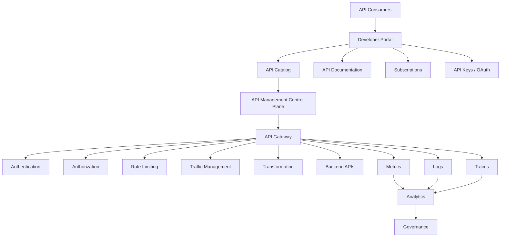
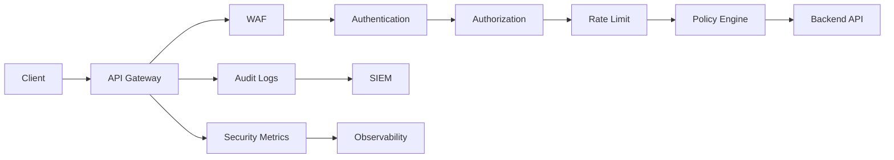
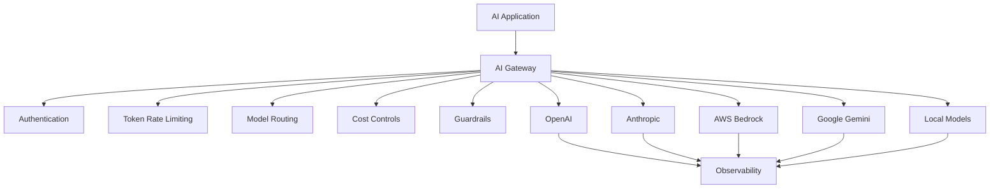

# ⚡ Awesome-API-Management

<p align="center">
  <a href="https://github.com/ishandutta2007/Awesome-Awesome-Awesome"></a>
  <a href="https://discord.gg/jc4xtF58Ve"></a>
  <a href="https://github.com/ishandutta2007/Awesome-API-Management/stargazers"></a>
  <a href="https://github.com/ishandutta2007/Awesome-API-Management/network/members"></a>
  <a href="https://github.com/ishandutta2007/Awesome-API-Management/issues"></a>
  <a href="https://github.com/ishandutta2007/Awesome-API-Management/pulls"></a>
  <a href="https://github.com/ishandutta2007/Awesome-API-Management/blob/main/LICENSE"></a>
  <a href="https://github.com/ishandutta2007"></a>
</p>

<p align="center">
  
</p>

# 🔌 Top API Management Platforms & Open-Source API Gateways

> 🚀 A curated directory of **API Management platforms, cloud API gateways, developer portals, API security & WAF engines, lifecycle governance, AI/LLM gateways, and open-source API management ecosystems** for designing, testing, securing, routing, and monetizing modern APIs.


API Management goes far beyond simply routing HTTP requests. A modern API management platform typically combines:


* API Gateway

* API lifecycle management

* API security

* Authentication & authorization

* Rate limiting

* Traffic management

* Developer portals

* API discovery

* API products

* Analytics

* Governance

* Versioning

* Monetization

* Policy enforcement

* Service mesh / Kubernetes integration

* GraphQL management

* Event-driven APIs

* AI / LLM gateway capabilities


This repository focuses primarily on **open-source and self-hostable API management software**, while maintaining a separate list of commercial and hosted platforms such as **Postman, Apigee, Kong Konnect, Stoplight, RapidAPI, Gravitee, DreamFactory, Boomi, MuleSoft, Tyk, Azure API Management, WSO2, IBM API Connect and Akana**.


Modern API management has increasingly split into several related categories:


```text

                         API MANAGEMENT

                               │

       ┌───────────────────────┼────────────────────────┐

       │                       │                        │

       ▼                       ▼                        ▼

   API Gateway            API Lifecycle            Developer

       │                   Management                Portal

       │                       │                        │

       ▼                       ▼                        ▼

  Security                  Design                  Discovery

  Routing                   Testing                 Documentation

  Policies                  Governance              Subscription

  Rate Limits               Versioning              API Products

       │                       │                        │

       └───────────────────────┼────────────────────────┘

                               ▼

                         API Analytics

                               │

                               ▼

                     API Security / Governance

```


The open-source ecosystem is especially strong at the **gateway and runtime layer**, while complete enterprise API management suites often combine gateways with proprietary control planes, portals, analytics and governance.


---


## 📑 Table of Contents


* [☁️ SaaS/Hosted Platforms](#️-saashosted-platforms)

* [🌍 Open-Source](#-open-source)

* [🚪 Open-Source API Gateways](#-open-source-api-gateways)

* [🏢 Full Open-Source API Management Platforms](#-full-open-source-api-management-platforms)

* [📖 Open-Source Developer Portals](#-open-source-developer-portals)

* [📝 Open-Source API Design & Specification Tools](#-open-source-api-design--specification-tools)

* [🔐 Open-Source API Security](#-open-source-api-security)

* [⚡ Open-Source API Traffic Management](#-open-source-api-traffic-management)

* [📊 Open-Source API Analytics & Observability](#-open-source-api-analytics--observability)

* [☸️ Open-Source Kubernetes API Management](#️-open-source-kubernetes-api-management)

* [🤖 Open-Source AI & LLM API Gateways](#-open-source-ai--llm-api-gateways)

* [🌐 Open-Source GraphQL API Management](#-open-source-graphql-api-management)

* [🧩 Open-Source API Gateway Plugins & Extensions](#-open-source-api-gateway-plugins--extensions)

* [🔄 Open-Source API Lifecycle Management](#-open-source-api-lifecycle-management)

* [🧩 Commercial Platform → Open-Source Equivalent](#-commercial-platform--open-source-equivalent)

* [🏗️ API Management Architecture](#️-api-management-architecture)

* [🔄 Open-Source API Management Architecture](#-open-source-api-management-architecture)

* [🔐 API Security Architecture](#-api-security-architecture)

* [📊 API Analytics Architecture](#-api-analytics-architecture)

* [🤖 AI Gateway Architecture](#-ai-gateway-architecture)

* [⚖️ Commercial vs Open-Source](#️-commercial-vs-open-source)

* [🚀 Recommended Open-Source Stacks](#-recommended-open-source-stacks)

* [📊 API Management Technology Comparison](#-api-management-technology-comparison)

* [🎯 Recommended Projects by Use Case](#-recommended-projects-by-use-case)

* [🏢 Building an Apigee Alternative](#-building-an-apigee-alternative)

* [🔌 Building a Kong Alternative](#-building-a-kong-alternative)

* [🌐 Open-Source API Management Landscape](#-open-source-api-management-landscape)

* [🧠 Why Open-Source API Management Matters](#-why-open-source-api-management-matters)

* [🤝 Contributing](#-contributing)

* [⚠️ Disclaimer](#️-disclaimer)


---


# ☁️ SaaS/Hosted Platforms

> 📈 **Market Intelligence:** The global API Management market is valued at **$5.8 Billion in 2025** and projected to surge to **$17.4 Billion by 2030** (CAGR ~24.6%). The sector is **moderately fragmented**—dominated at the enterprise tier by cloud hyperscalers (Microsoft Azure, Google Cloud Apigee, AWS) and legacy integration giants (Salesforce MuleSoft, IBM), while specialized API platform pioneers (Kong, Postman, Tyk, Gravitee) and a rapidly expanding open-source ecosystem command significant developer velocity, preventing a winner-take-all monopoly.

Commercial API management platforms provide combinations of API gateways, developer portals, analytics, governance, security, lifecycle management and API products.

| 🏢 Platform | 🏛️ Company | 💰 Valuation / Revenue | 💵 Starting Tier Pricing | 🎁 Free Tier / Trial Limits | 🎯 Primary Focus | 🔑 Key Capabilities |
| :--- | :--- | :--- | :--- | :--- | :--- | :--- |
| [Azure API Management](https://azure.microsoft.com/products/api-management/) | Microsoft | Valuation ~$3.1T / Revenue ~$245B | Consumption: $0.000035/call ($3.50 per 100k calls); Developer tier: $48.04/month per unit | 1,000,000 free API calls/month forever on Consumption tier; plus 30-day free trial with $200 Azure credits | Enterprise API management | Gateway, developer portal, policies, analytics, hybrid deployment |
| [Apigee](https://cloud.google.com/apigee) | Google Cloud | Valuation ~$2.1T / Revenue ~$350B | Pay-as-you-go: $0.20/env/hr (~$146/month) + $20/million calls (Standard proxies) | 60-day free evaluation tier (sandbox env, up to 10 proxies/environments) + 90-day $300 Google Cloud trial credits | Enterprise API management | Gateway, analytics, AI security, portals, monetization, governance |
| [AWS API Gateway](https://aws.amazon.com/api-gateway/) | AWS | Valuation ~$2.0T / Revenue ~$575B | $1.00/million calls (HTTP APIs) or $3.50/million calls (REST APIs up to 333M/mo) | 12-month free tier: 1,000,000 HTTP/REST API calls and 1,000,000 WebSocket messages per month | Cloud API gateway | REST, HTTP, WebSocket APIs, throttling, native AWS integration |
| [MuleSoft Anypoint Platform](https://www.mulesoft.com/platform/api) | Salesforce | Valuation ~$260B / Revenue ~$35B | Anypoint Starter: ~$2,500/month ($30,000/year base) or PAYG starting at $1,000/mo | 30-day free trial with full platform access (design, mock, deploy to CloudHub up to 1 vCore) | Integration + API management | API design, gateway, integration, governance, analytics, marketplace |
| [IBM API Connect](https://www.ibm.com/products/api-connect) | IBM | Valuation ~$200B / Revenue ~$62B | IBM Cloud Developer instance: $100/month (100,000 calls included; then $0.001/call); Enterprise SaaS: $1,250/month | 30-day free trial with full API manager, developer portal, and test environment up to 50,000 test calls | Enterprise API management | API lifecycle, gateway, security, analytics, developer portal |
| [Red Hat 3scale](https://www.redhat.com/en/technologies/jboss-middleware/3scale) | Red Hat (IBM) | Acquired for $34B (by IBM) | Red Hat OpenShift API Management: ~$1,500/month; Enterprise 3scale subscription: ~$18,000/year | 90-day free trial via Red Hat Developer Sandbox (up to 20 API requests/second limit) | API management | Gateway, developer portal, policies, analytics, API products |
| [Postman](https://www.postman.com/) | Postman | Valuation ~$5.6B / ARR ~$150M+ | Solo plan: $9/user/month (annual) or $12/month; Team plan: $19/user/month (annual) or $24/month | Free forever plan: 1 user, 1,000 monitoring requests/mo, 50 AI credits/mo, unlimited collection runs & mock calls | API platform | Design, testing, documentation, collaboration, API governance, workspaces |
| [Boomi API Management](https://boomi.com/platform/api-management/) | Boomi | Valuation ~$4.0B / Revenue ~$400M | Base edition: ~$2,000/month ($24,000/year base) | 30-day free trial with full AtomSphere access, up to 3 integrations/APIs deployed | Integration + API management | API lifecycle, integration, gateway, security, governance |
| [webMethods API Management](https://www.softwareag.com/) | Software AG | Valuation ~$3.5B / Revenue ~$950M | webMethods.io API Basic: ~$580/month (up to 500,000 API transactions/month) | 30-day free trial with full enterprise gateway and portal features, limited to 50,000 transactions | Integration + API management | API gateway, lifecycle, integration, governance |
| [Akana](https://www.akana.com/) | Perforce / Akana | Valuation ~$2.5B / Revenue ~$300M | Business subscription: ~$2,080/month ($25,000/year base) | 30-day free trial sandbox with full API design, security policies, and developer portal | Enterprise API management | API gateway, security, lifecycle management, governance |
| [Kong Konnect](https://konghq.com/products/kong-konnect) | Kong | Valuation ~$2.0B / ARR ~$100M+ | Plus tier: $250/month (includes 3 control planes, 10M API requests/month) | Free forever tier: 1 service, 1 control plane, up to 500,000 requests/mo; 30-day Enterprise free trial | Cloud API management & AI Gateway | Gateway, control plane, security, analytics, portals, AI gateway |
| [Stoplight](https://stoplight.io/) | SmartBear | Valuation ~$1.2B / Revenue ~$150M+ | Basic plan: $39/month (up to 3 editors); Pro plan: $99/month | Free forever plan: 1 project, 3 users, unlimited design & documentation, web mock server | API design & governance | OpenAPI design, documentation, mocking, governance, collaboration |
| [Axway Amplify](https://www.axway.com/en/products/api-management) | Axway | Market Cap ~$1.1B / Revenue ~$330M | Amplify Essential: ~$1,200/month ($14,400/year base) | 30-day free trial of Amplify Enterprise Marketplace with full catalog & discovery integration | Enterprise API management | API lifecycle, multi-gateway governance, security, catalog |
| [RapidAPI](https://rapidapi.com/) | Rapid | Valuation ~$1.0B / Revenue ~$50M | Pro plan: $10/month; Private API Hub basic: $10/month | Free forever basic plan: consume public APIs (free tiers per API, 100–1,000 calls/mo), 1 private API listing | API marketplace & hub | API discovery, marketplace, testing, analytics, enterprise hub |
| [WSO2 API Manager](https://wso2.com/api-manager/) | WSO2 | Valuation ~$600M / Revenue ~$100M | Choreo PAYG: $50/component/month; WSO2 Cloud APIM: $1,000/month | Free forever tier: 5 components, 1,000 build mins/mo, 100,000 API calls/mo on Choreo; 14-day trial on WSO2 Cloud | Full API lifecycle | Gateway, publisher, developer portal, analytics, governance |
| [Gravitee](https://www.gravitee.io/) | Gravitee | Valuation ~$500M / ARR ~$40M | Gravitee Cloud Starter: $400/month (managed control plane, 1M API calls/mo) | 14-day free trial with full Enterprise features (event APIs, secrets, alerting); OSS core is free forever | API & Event-native management | Gateway, event-native APIs (Kafka/MQTT), portal, policies, analytics |
| [Sensedia](https://www.sensedia.com/) | Sensedia | Valuation ~$150M / Revenue ~$40M | Growth package: ~$1,500/month (up to 2 million API calls/month) | 30-day free trial sandbox with gateway, analytics, and developer portal | API management | Gateway, governance, developer portal, integration |
| [Tyk](https://tyk.io/) | Tyk | Valuation ~$120M / ARR ~$25M | Tyk Cloud PayG: $0.07/hour (~$50/month) base; Developer plan: $120/month | 14-day free trial with unlimited API calls, full dashboard & developer portal; OSS gateway is free forever | API management | Gateway, dashboard, developer portal, analytics, GraphQL |
| [DreamFactory](https://www.dreamfactory.com/) | DreamFactory | Valuation ~$20M / Revenue ~$5M | Standard plan: $499/month (instant REST APIs, unlimited databases) | 14-day free trial with unlimited API generation, connecting up to 5 databases | API generation | Automatic REST APIs for databases, SOAP-to-REST, enterprise auth |

> **Note:** API platforms vary substantially in scope. Some are primarily API lifecycle/developer platforms, while others are gateway-first API management systems. Postman and Stoplight, for example, are especially strong in API development workflows, while Apigee, Kong, Azure APIM, WSO2 and MuleSoft span broader API management capabilities.


---


# 🌍 Open-Source


The open-source API management ecosystem is significantly broader than a simple list of API gateways.


It includes:


```text

                         OPEN-SOURCE API MANAGEMENT

                                     │

       ┌─────────────────────────────┼─────────────────────────────┐

       │                             │                             │

       ▼                             ▼                             ▼

 API Gateways                 Management Suites             API Tooling

       │                             │                             │

       ▼                             ▼                             ▼

 Apache APISIX                 WSO2 API Manager          OpenAPI

 Kong OSS                     Gravitee CE               Swagger UI

 Tyk OSS                      Tyk OSS                   Redoc

 KrakenD                      Kong OSS                  Scalar

 Traefik                       API7                      Spectral

 Envoy                         Apache APISIX

       │

       └──────────────────────────────┬─────────────────────────────┘

                                      ▼

                             Security / Analytics

                                      │

                                      ▼

                            Developer Experience

```


---


# 🚪 Open-Source API Gateways

API gateways are the runtime foundation of many API management systems.

| 🚪 Project | 🌟 Stars | 📝 Description | 📜 License |
| :--- | :---: | :--- | :--- |
| [Caddy](https://github.com/caddyserver/caddy) | [](https://github.com/caddyserver/caddy/stargazers) | Extensible web server, automatic HTTPS & reverse proxy | Apache-2.0 |
| [Traefik](https://github.com/traefik/traefik) | [](https://github.com/traefik/traefik/stargazers) | Cloud-native HTTP reverse proxy & API edge router | MIT |
| [Kong Gateway](https://github.com/Kong/kong) | [](https://github.com/Kong/kong/stargazers) | Cloud-native, high-performance extensible API gateway | Apache-2.0 OSS core |
| [Envoy Proxy](https://github.com/envoyproxy/envoy) | [](https://github.com/envoyproxy/envoy/stargazers) | Cloud-native high-performance edge/service proxy | Apache-2.0 |
| [NGINX](https://github.com/nginx/nginx) | [](https://github.com/nginx/nginx/stargazers) | High-performance reverse proxy & gateway foundation | BSD-2-Clause |
| [Apache APISIX](https://github.com/apache/apisix) | [](https://github.com/apache/apisix/stargazers) | Dynamic, high-performance cloud-native API gateway | Apache-2.0 |
| [Zuul](https://github.com/Netflix/zuul) | [](https://github.com/Netflix/zuul/stargazers) | Programmable edge routing & dynamic filters service | Apache-2.0 |
| [Spring Cloud Gateway](https://github.com/spring-cloud/spring-cloud-gateway) | [](https://github.com/spring-cloud/spring-cloud-gateway/stargazers) | Non-blocking API Gateway built on Spring WebFlux | Apache-2.0 |
| [Tyk](https://github.com/TykTechnologies/tyk) | [](https://github.com/TykTechnologies/tyk/stargazers) | Fast, scalable, Go-based open-source API gateway | MPL-2.0 |
| [KrakenD](https://github.com/krakendio/krakend-ce) | [](https://github.com/krakendio/krakend-ce/stargazers) | Ultra high-performance stateless API gateway | Apache-2.0 |
| [Easegress](https://github.com/megaease/easegress) | [](https://github.com/megaease/easegress/stargazers) | Cloud-native traffic orchestration & pipeline gateway | Apache-2.0 |
| [Higress](https://github.com/alibaba/higress) | [](https://github.com/alibaba/higress/stargazers) | Next-gen cloud-native API gateway & AI gateway | Apache-2.0 |
| [Gloo Gateway](https://github.com/kgateway-dev/kgateway) | [](https://github.com/kgateway-dev/kgateway/stargazers) | Kubernetes-native API gateway & Ingress (Envoy-based) | Apache-2.0 |
| [Gravitee API Management](https://github.com/gravitee-io/gravitee-api-management) | [](https://github.com/gravitee-io/gravitee-api-management/stargazers) | Event-native API gateway & management platform | Apache-2.0 core |
| [APISIX Ingress Controller](https://github.com/apache/apisix-ingress-controller) | [](https://github.com/apache/apisix-ingress-controller/stargazers) | Kubernetes ingress controller for Apache APISIX | Apache-2.0 |
| [Janus](https://github.com/hellofresh/janus) | [](https://github.com/hellofresh/janus/stargazers) | Cloud-native API gateway written in Go with plugin system | MIT |
| [Kusk Gateway](https://github.com/kubeshop/kusk-gateway) | [](https://github.com/kubeshop/kusk-gateway/stargazers) | OpenAPI-driven Kubernetes API Gateway powered by Envoy | MIT |

Apache APISIX is a particularly complete open-source gateway, with dynamic routing, load balancing, authentication, traffic management, observability and a large plugin ecosystem. Its current project is an Apache Software Foundation top-level project under Apache-2.0.


---


# 🏢 Full Open-Source API Management Platforms

A gateway alone is not necessarily a complete API management platform.

Full API management generally adds:

```text
Gateway
   +
API Publisher
   +
Developer Portal
   +
API Catalog
   +
Subscriptions
   +
Policies
   +
Analytics
   +
Governance
   +
Lifecycle Management
```

| 🏢 Project | 🌟 Stars | 🚪 Gateway | 📖 Portal | ⚙️ Management | 📊 Analytics | 🛡️ Governance |
| :--- | :---: | :---: | :---: | :---: | :---: | :---: |
| [Kong](https://github.com/Kong/kong) | [](https://github.com/Kong/kong/stargazers) | ✅ | ⚠️ | ⚠️ | ⚠️ | ⚠️ |
| [Apache APISIX](https://github.com/apache/apisix) | [](https://github.com/apache/apisix/stargazers) | ✅ | ⚠️ | ⚠️ | ⚠️ | ⚠️ |
| [Tyk](https://github.com/TykTechnologies/tyk) | [](https://github.com/TykTechnologies/tyk/stargazers) | ✅ | ⚠️ | ⚠️ | ⚠️ | ⚠️ |
| [Gloo Gateway](https://github.com/kgateway-dev/kgateway) | [](https://github.com/kgateway-dev/kgateway/stargazers) | ✅ | ⚠️ | ⚠️ | ⚠️ | ⚠️ |
| [Fusio](https://github.com/apioo/fusio) | [](https://github.com/apioo/fusio/stargazers) | ✅ | ✅ | ✅ | ✅ | ✅ |
| [Gravitee](https://github.com/gravitee-io/gravitee-api-management) | [](https://github.com/gravitee-io/gravitee-api-management/stargazers) | ✅ | ✅ | ✅ | ✅ | ✅ |
| [WSO2 API Manager](https://github.com/wso2/product-apim) | [](https://github.com/wso2/product-apim/stargazers) | ✅ | ✅ | ✅ | ✅ | ✅ |
| [WSO2 APK](https://github.com/wso2/apk) | [](https://github.com/wso2/apk/stargazers) | ✅ | ✅ | ✅ | ✅ | ✅ |
| [API7](https://github.com/api7/api7) | [](https://github.com/api7/api7/stargazers) | APISIX | ✅ | ✅ | ✅ | ✅ |

> ⚠️ indicates that functionality may require separate components, integrations or commercial editions rather than being entirely contained in the open-source gateway.


Current comparisons distinguish these licensing models carefully: WSO2 API Manager is positioned as a fully open-source full-lifecycle suite, while Kong, Tyk and Gravitee combine open-source gateway/community components with commercial management capabilities.


---


# 🏆 WSO2 API Manager


[WSO2 API Manager](https://github.com/wso2/product-apim) is one of the closest open-source projects to a traditional enterprise API management suite.


It includes concepts such as:


* API Gateway

* API Publisher

* Developer Portal

* API subscriptions

* Authentication

* Authorization

* Rate limiting

* Policies

* Analytics

* API lifecycle management

* API governance


```text

                  WSO2 API Manager

                         │

        ┌────────────────┼────────────────┐

        ▼                ▼                ▼

    Publisher        Developer Portal   Gateway

        │                │                │

        └────────────────┼────────────────┘

                         ▼

                     Analytics

                         │

                         ▼

                     Governance

```


WSO2 describes its API platform as fully open source, making it one of the strongest candidates when the requirement is a **full API management suite rather than merely an API gateway**.


---


# 🌊 Gravitee


[Gravitee](https://github.com/gravitee-io/gravitee-api-management) provides an open-source API management ecosystem with a particular emphasis on both REST and event-driven APIs.


Useful for:


* REST APIs

* Kafka

* MQTT

* Event-driven APIs

* API Gateway

* Developer Portal

* API policies

* API lifecycle

* API governance


Gravitee is especially interesting for organizations managing APIs alongside event-driven architectures. Current comparisons identify its community/core gateway as open source while distinguishing commercial/enterprise functionality.


---


# 🚪 Apache APISIX


[Apache APISIX](https://github.com/apache/apisix) is one of the strongest open-source API gateway foundations.


Architecture:


```text

                     Apache APISIX

                           │

                           ▼

                       NGINX/Lua

                           │

                           ▼

                         etcd

                           │

             ┌─────────────┼─────────────┐

             ▼             ▼             ▼

          Routing      Plugins       Policies

             │             │             │

             └─────────────┼─────────────┘

                           ▼

                        Services

```


Capabilities include:


* Dynamic routing

* Load balancing

* Authentication

* JWT

* OIDC

* Rate limiting

* Circuit breaking

* Canary releases

* Observability

* gRPC

* WebSockets

* MQTT

* Kubernetes

* AI gateway functionality


Apache APISIX currently advertises more than 100 plugins and supports both conventional API traffic and AI/LLM gateway workloads.


---


# 🧱 Kong Gateway


[Kong Gateway](https://github.com/Kong/kong) is one of the most widely used open-source API gateway projects.


It provides:


* Routing

* Authentication

* Rate limiting

* Transformations

* Logging

* Metrics

* Load balancing

* Plugin architecture

* Service discovery

* Kubernetes integration


Kong's architecture can operate using database-backed, DB-less or hybrid approaches.


```text

                    Kong Gateway

                         │

             ┌───────────┼───────────┐

             ▼           ▼           ▼

          Routes      Plugins     Policies

             │           │           │

             └───────────┼───────────┘

                         ▼

                     Upstream

```


---


# 🐝 Tyk


[Tyk](https://github.com/TykTechnologies/tyk) is a Go-based API gateway with an open-source gateway and additional management components.


Core capabilities include:


* API gateway

* Authentication

* Rate limiting

* API versioning

* GraphQL

* Service discovery

* Middleware

* Observability

* Developer portal integrations


Tyk's current ecosystem combines an open-source gateway with commercial management functionality, so users should distinguish the OSS gateway from paid components.


---


# 📖 Open-Source Developer Portals

A developer portal is an essential component of API management.

```text
                 API Catalog
                     │
        ┌────────────┼────────────┐
        ▼            ▼            ▼
 Documentation    Try API      Credentials
        │            │            │
        └────────────┼────────────┘
                     ▼
                 Subscribe
```

| 📖 Project | 🌟 Stars | 📝 Description |
| :--- | :---: | :--- |
| [Docusaurus](https://github.com/facebook/docusaurus) | [](https://github.com/facebook/docusaurus/stargazers) | Modern documentation platform with OpenAPI integrations |
| [Scalar](https://github.com/scalar/scalar) | [](https://github.com/scalar/scalar/stargazers) | Modern, beautiful API reference, client, and documentation portal |
| [Swagger UI](https://github.com/swagger-api/swagger-ui) | [](https://github.com/swagger-api/swagger-ui/stargazers) | Standard interactive OpenAPI UI for exploring and testing endpoints |
| [Backstage](https://github.com/backstage/backstage) | [](https://github.com/backstage/backstage/stargazers) | Spotify's open platform for building developer portals and catalogs |
| [Redoc](https://github.com/Redocly/redoc) | [](https://github.com/Redocly/redoc/stargazers) | Clean, responsive, three-panel OpenAPI documentation renderer |
| [MkDocs](https://github.com/mkdocs/mkdocs) | [](https://github.com/mkdocs/mkdocs/stargazers) | Fast, simple static site generator geared towards project docs |
| [Docusaurus OpenAPI Docs](https://github.com/PaloAltoNetworks/docusaurus-openapi-docs) | [](https://github.com/PaloAltoNetworks/docusaurus-openapi-docs/stargazers) | Plugin to generate interactive OpenAPI docs for Docusaurus |
| [Gravitee Developer Portal](https://github.com/gravitee-io/gravitee-api-management) | [](https://github.com/gravitee-io/gravitee-api-management/stargazers) | Self-service API catalog, documentation, and consumption portal |
| [WSO2 Developer Portal](https://github.com/wso2/product-apim) | [](https://github.com/wso2/product-apim/stargazers) | Enterprise API discovery, self-registration, and subscriptions |
| [OpenAPI Explorer](https://github.com/rohit-gohri/redoc) | [](https://github.com/rohit-gohri/redoc/stargazers) | OpenAPI exploration and testing tooling |

A powerful open-source approach is to combine an API gateway with **Backstage + Swagger UI/Redoc/Scalar** to build a customized internal API portal.


---


# 📝 Open-Source API Design & Specification Tools

API management begins before deployment.

| 📝 Project | 🌟 Stars | 🎯 Primary Role |
| :--- | :---: | :--- |
| [Scalar](https://github.com/scalar/scalar) | [](https://github.com/scalar/scalar/stargazers) | Modern API references, interactive design and client |
| [Swagger UI](https://github.com/swagger-api/swagger-ui) | [](https://github.com/swagger-api/swagger-ui/stargazers) | Interactive API documentation & endpoint testing |
| [Redoc](https://github.com/Redocly/redoc) | [](https://github.com/Redocly/redoc/stargazers) | Three-panel responsive API documentation |
| [OpenAPI Generator](https://github.com/OpenAPITools/openapi-generator) | [](https://github.com/OpenAPITools/openapi-generator/stargazers) | SDK, API client, and server stub generation (50+ languages) |
| [OpenAPI Specification](https://github.com/OAI/OpenAPI-Specification) | [](https://github.com/OAI/OpenAPI-Specification/stargazers) | Global standard description format for RESTful APIs |
| [Swagger Editor](https://github.com/swagger-api/swagger-editor) | [](https://github.com/swagger-api/swagger-editor/stargazers) | Browser-based OpenAPI definition editor & validator |
| [Prism](https://github.com/stoplightio/prism) | [](https://github.com/stoplightio/prism/stargazers) | OpenAPI-driven HTTP mock server and contract validation |
| [Spectral](https://github.com/stoplightio/spectral) | [](https://github.com/stoplightio/spectral/stargazers) | Flexible JSON/YAML linter for API style guides and governance |
| [Schemathesis](https://github.com/schemathesis/schemathesis) | [](https://github.com/schemathesis/schemathesis/stargazers) | Property-based testing & fuzzing for OpenAPI/GraphQL |
| [openapi-diff](https://github.com/Tufin/oasdiff) | [](https://github.com/Tufin/oasdiff/stargazers) | OpenAPI breaking-change detector, diff engine and linter |
| [Dredd](https://github.com/apiaryio/dredd) | [](https://github.com/apiaryio/dredd/stargazers) | HTTP API contract testing against API documentation |
| [RESTler](https://github.com/microsoft/restler-fuzzer) | [](https://github.com/microsoft/restler-fuzzer/stargazers) | Stateful REST API fuzzing and vulnerability finder |
| [Kiota](https://github.com/microsoft/kiota) | [](https://github.com/microsoft/kiota/stargazers) | Lightweight OpenAPI client generator by Microsoft |

---

# 🔐 Open-Source API Security

API management and API security are closely related but not identical.

Useful projects include:

| 🔐 Project | 🌟 Stars | 🛡️ Role |
| :--- | :---: | :--- |
| [Envoy](https://github.com/envoyproxy/envoy) | [](https://github.com/envoyproxy/envoy/stargazers) | Security-aware high-performance proxy & mTLS terminator |
| [Keycloak](https://github.com/keycloak/keycloak) | [](https://github.com/keycloak/keycloak/stargazers) | Open-source IAM, OAuth2, OIDC, and SAML identity broker |
| [Apache APISIX](https://github.com/apache/apisix) | [](https://github.com/apache/apisix/stargazers) | Gateway security policies, token introspection, and WAF |
| [cert-manager](https://github.com/cert-manager/cert-manager) | [](https://github.com/cert-manager/cert-manager/stargazers) | Automated TLS/mTLS certificate management for Kubernetes |
| [Open Policy Agent](https://github.com/open-policy-agent/opa) | [](https://github.com/open-policy-agent/opa/stargazers) | Flexible, general-purpose policy engine for microservices & APIs |
| [Tyk](https://github.com/TykTechnologies/tyk) | [](https://github.com/TykTechnologies/tyk/stargazers) | Gateway-level authentication, authorization, and rate limiting |
| [oauth2-proxy](https://github.com/oauth2-proxy/oauth2-proxy) | [](https://github.com/oauth2-proxy/oauth2-proxy/stargazers) | Reverse proxy providing authentication using OIDC / OAuth2 |
| [ModSecurity](https://github.com/owasp-modsecurity/ModSecurity) | [](https://github.com/owasp-modsecurity/ModSecurity/stargazers) | Battle-tested web application firewall engine |
| [OWASP CRS](https://github.com/coreruleset/coreruleset) | [](https://github.com/coreruleset/coreruleset/stargazers) | Generic attack detection rules for WAFs against OWASP Top 10 |
| [Coraza](https://github.com/corazawaf/coraza) | [](https://github.com/corazawaf/coraza/stargazers) | Enterprise-grade Golang Web Application Firewall |
| [SPIRE](https://github.com/spiffe/spire) | [](https://github.com/spiffe/spire/stargazers) | Workload identity provider using SPIFFE standards |

---

# ⚡ Open-Source API Traffic Management

Modern API gateways commonly implement:

```text
Rate Limiting
     │
     ├── Requests / second
     ├── Requests / minute
     ├── Token limits
     └── Consumer quotas

Traffic Control
     │
     ├── Load balancing
     ├── Retries
     ├── Circuit breaking
     ├── Timeouts
     └── Failover

Routing
     │
     ├── Host-based
     ├── Path-based
     ├── Header-based
     ├── Canary
     └── Weighted
```

Strong open-source choices:

| ⚡ Project | 🌟 Stars | 🚀 Strength |
| :--- | :---: | :--- |
| [Traefik](https://github.com/traefik/traefik) | [](https://github.com/traefik/traefik/stargazers) | Cloud-native routing & automatic service discovery |
| [Kong](https://github.com/Kong/kong) | [](https://github.com/Kong/kong/stargazers) | Mature rate limiting, canary releases, & plugin ecosystem |
| [Envoy](https://github.com/envoyproxy/envoy) | [](https://github.com/envoyproxy/envoy/stargazers) | Advanced connection pooling, circuit breaking, & retries |
| [NGINX](https://github.com/nginx/nginx) | [](https://github.com/nginx/nginx/stargazers) | Extremely battle-tested reverse proxying & load balancing |
| [Apache APISIX](https://github.com/apache/apisix) | [](https://github.com/apache/apisix/stargazers) | Ultra-dynamic traffic splitting, canary, & zero-reload routing |
| [Tyk](https://github.com/TykTechnologies/tyk) | [](https://github.com/TykTechnologies/tyk/stargazers) | Fine-grained API quotas, rate limiting, & token management |
| [KrakenD](https://github.com/krakendio/krakend-ce) | [](https://github.com/krakendio/krakend-ce/stargazers) | High-throughput stateless request aggregation & manipulation |
| [Lunar.dev](https://github.com/lunar-labs/lunar) | [](https://github.com/lunar-labs/lunar/stargazers) | API consumption management, egress rate limiting, and caching |
| [Higress](https://github.com/alibaba/higress) | [](https://github.com/alibaba/higress/stargazers) | Ingress + API Gateway integrated traffic management |
| [Gloo Gateway](https://github.com/kgateway-dev/kgateway) | [](https://github.com/kgateway-dev/kgateway/stargazers) | Kubernetes Gateway API traffic routing & Envoy control plane |

---

# 📊 Open-Source API Analytics & Observability

API management needs visibility into:

* Requests
* Latency
* Errors
* Consumers
* API versions
* Endpoints
* Status codes
* Traffic
* Rate limits
* Authentication failures
* Upstream failures

| 📊 Project | 🌟 Stars | 🔍 Role |
| :--- | :---: | :--- |
| [Grafana](https://github.com/grafana/grafana) | [](https://github.com/grafana/grafana/stargazers) | Unified operational dashboards, analytics, and visualization |
| [Prometheus](https://github.com/prometheus/prometheus) | [](https://github.com/prometheus/prometheus/stargazers) | Time-series metrics collection, alerting, and monitoring |
| [ClickHouse](https://github.com/ClickHouse/ClickHouse) | [](https://github.com/ClickHouse/ClickHouse/stargazers) | High-speed columnar analytics database for API request logs |
| [Apache SkyWalking](https://github.com/apache/skywalking) | [](https://github.com/apache/skywalking/stargazers) | APM, distributed tracing, and mesh observability |
| [Loki](https://github.com/grafana/loki) | [](https://github.com/grafana/loki/stargazers) | Horizontally-scalable, log aggregation system |
| [Jaeger](https://github.com/jaegertracing/jaeger) | [](https://github.com/jaegertracing/jaeger/stargazers) | CNCF distributed tracing and latency root-cause analysis |
| [Zipkin](https://github.com/openzipkin/zipkin) | [](https://github.com/openzipkin/zipkin/stargazers) | Distributed tracing system for latency troubleshooting |
| [VictoriaMetrics](https://github.com/VictoriaMetrics/VictoriaMetrics) | [](https://github.com/VictoriaMetrics/VictoriaMetrics/stargazers) | Cost-effective, long-term storage for Prometheus metrics |
| [OpenSearch](https://github.com/opensearch-project/OpenSearch) | [](https://github.com/opensearch-project/OpenSearch/stargazers) | Distributed search and analytics suite for API logs |
| [OpenTelemetry](https://github.com/open-telemetry/opentelemetry-collector) | [](https://github.com/open-telemetry/opentelemetry-collector/stargazers) | Vendor-agnostic telemetry ingestion, processing, & export |

Example:


```text

                       API Gateway

                            │

             ┌──────────────┼──────────────┐

             ▼              ▼              ▼

          Metrics         Logs          Traces

             │              │              │

             ▼              ▼              ▼

        Prometheus         Loki          Jaeger

             │              │              │

             └──────────────┼──────────────┘

                            ▼

                         Grafana

```


---


# ☸️ Open-Source Kubernetes API Management

Kubernetes has become a major deployment environment for API gateways.

| ☸️ Project | 🌟 Stars | ⚙️ Kubernetes Capability |
| :--- | :---: | :--- |
| [Traefik](https://github.com/traefik/traefik) | [](https://github.com/traefik/traefik/stargazers) | Native Ingress, CRDs, and Gateway API provider |
| [NGINX Ingress](https://github.com/kubernetes/ingress-nginx) | [](https://github.com/kubernetes/ingress-nginx/stargazers) | Community-standard Kubernetes Ingress Controller |
| [Kong Ingress Controller](https://github.com/Kong/kubernetes-ingress-controller) | [](https://github.com/Kong/kubernetes-ingress-controller/stargazers) | Ingress controller & Gateway API for Kong Gateway |
| [Envoy Gateway](https://github.com/envoyproxy/gateway) | [](https://github.com/envoyproxy/gateway/stargazers) | Official Envoy project for Kubernetes Gateway API |
| [Higress](https://github.com/alibaba/higress) | [](https://github.com/alibaba/higress/stargazers) | Cloud-native gateway with built-in Kubernetes Gateway API |
| [Gloo Gateway](https://github.com/kgateway-dev/kgateway) | [](https://github.com/kgateway-dev/kgateway/stargazers) | Kubernetes Gateway API implementation based on Envoy |
| [APISIX Ingress Controller](https://github.com/apache/apisix-ingress-controller) | [](https://github.com/apache/apisix-ingress-controller/stargazers) | Declarative CRDs and Gateway API for Apache APISIX |
| [HAProxy Ingress](https://github.com/haproxytech/kubernetes-ingress) | [](https://github.com/haproxytech/kubernetes-ingress/stargazers) | High-performance HAProxy-based Kubernetes ingress |
| [Tyk Operator](https://github.com/TykTechnologies/tyk-operator) | [](https://github.com/TykTechnologies/tyk-operator/stargazers) | GitOps-driven Kubernetes operator for Tyk API definitions |
| [Gravitee Operator](https://github.com/gravitee-io/gravitee-kubernetes-operator) | [](https://github.com/gravitee-io/gravitee-kubernetes-operator/stargazers) | Kubernetes native API deployment CRDs for Gravitee |

A modern Kubernetes API management architecture:


```text

                     Internet

                        │

                        ▼

                Cloud Load Balancer

                        │

                        ▼

                  API Gateway

                        │

               ┌────────┼────────┐

               ▼        ▼        ▼

             Service  Service  Service

               │        │        │

               └────────┼────────┘

                        ▼

                    Kubernetes

```


---


# 🤖 Open-Source AI & LLM API Gateways

API management is increasingly expanding into **AI Gateway** functionality.

Capabilities include:

* LLM provider routing
* Model routing
* Token-based rate limiting
* Cost controls
* Provider fallback
* Prompt security
* AI observability
* Model access policies
* MCP governance

| 🤖 Project | 🌟 Stars | 🧠 AI Gateway Capability |
| :--- | :---: | :--- |
| [Kong AI Gateway](https://github.com/Kong/kong) | [](https://github.com/Kong/kong/stargazers) | Multi-LLM traffic management, prompts, & token quotas |
| [LiteLLM](https://github.com/BerriAI/litellm) | [](https://github.com/BerriAI/litellm/stargazers) | Unified proxy for 100+ LLMs with load balancing & spend tracking |
| [Langfuse](https://github.com/langfuse/langfuse) | [](https://github.com/langfuse/langfuse/stargazers) | Open-source LLM engineering platform, tracing, & metrics |
| [Apache APISIX AI Gateway](https://github.com/apache/apisix) | [](https://github.com/apache/apisix/stargazers) | High-performance LLM routing, token rate limits, & AI plugins |
| [Portkey](https://github.com/Portkey-AI/gateway) | [](https://github.com/Portkey-AI/gateway/stargazers) | Enterprise AI gateway with guardrails, fallbacks, & caching |
| [Helicone](https://github.com/Helicone/helicone) | [](https://github.com/Helicone/helicone/stargazers) | LLM observability, cost tracking, caching, & gateway |
| [Higress](https://github.com/alibaba/higress) | [](https://github.com/alibaba/higress/stargazers) | AI gateway capabilities, multi-model fallback, & token throttling |
| [Envoy AI Gateway](https://github.com/envoyproxy/ai-gateway) | [](https://github.com/envoyproxy/ai-gateway/stargazers) | Kubernetes-native AI gateway initiative using Envoy |
| [ArchGW](https://github.com/archgw/archgw) | [](https://github.com/archgw/archgw/stargazers) | Intelligent AI-native gateway for agents and fast LLM routing |
| [TrueFoundry](https://github.com/truefoundry) | [](https://github.com/truefoundry/stargazers) | Unified AI infrastructure & LLM gateway management |

Apache APISIX currently positions itself as both an API gateway and AI gateway, including LLM provider routing, token rate limiting, retries/fallbacks and MCP-related functionality.


---


# 🌐 Open-Source GraphQL API Management

GraphQL introduces a different API management model.

| 🌐 Project | 🌟 Stars | 🧩 Role |
| :--- | :---: | :--- |
| [Hasura](https://github.com/hasura/graphql-engine) | [](https://github.com/hasura/graphql-engine/stargazers) | Instant, high-performance GraphQL API engine over databases |
| [Tyk](https://github.com/TykTechnologies/tyk) | [](https://github.com/TykTechnologies/tyk/stargazers) | Native Universal Data Graph & GraphQL rate limiting / auth |
| [Lago](https://github.com/getlago/lago) | [](https://github.com/getlago/lago/stargazers) | Open-source usage-based billing & monetization for APIs |
| [GraphQL Yoga](https://github.com/graphql-hive/graphql-yoga) | [](https://github.com/graphql-hive/graphql-yoga/stargazers) | Fully-featured, extensible GraphQL server runtime |
| [GraphQL Mesh](https://github.com/ardatan/graphql-mesh) | [](https://github.com/ardatan/graphql-mesh/stargazers) | API federation and query transformation gateway |
| [Apollo Router](https://github.com/apollographql/router) | [](https://github.com/apollographql/router/stargazers) | High-performance Rust-based GraphQL federation gateway |
| [Tailcall](https://github.com/tailcallhq/tailcall) | [](https://github.com/tailcallhq/tailcall/stargazers) | High-performance, declarative GraphQL gateway written in Rust |
| [GraphQL Hive](https://github.com/graphql-hive/console) | [](https://github.com/graphql-hive/console/stargazers) | Open-source GraphQL schema registry, analytics & alerts |

---

# 🧩 Open-Source API Gateway Plugins & Extensions


A major advantage of open-source API gateways is extensibility.


Typical plugins include:


```text

Authentication

├── API Keys

├── JWT

├── OAuth2

├── OIDC

└── mTLS


Security

├── WAF

├── IP filtering

├── Bot protection

└── Threat detection


Traffic

├── Rate limiting

├── Quotas

├── Load balancing

├── Retries

└── Circuit breaking


Transformation

├── Header rewriting

├── Request transformation

├── Response transformation

└── Protocol translation


Observability

├── Prometheus

├── OpenTelemetry

├── Jaeger

├── Zipkin

└── Logging

```


Apache APISIX, Kong, Envoy and Tyk all expose extensibility mechanisms, although their plugin models and licensing differ.


---


# 🔄 Open-Source API Lifecycle Management


API management should ideally cover the complete lifecycle:


```text

Design

  │

  ▼

Review

  │

  ▼

Lint

  │

  ▼

Mock

  │

  ▼

Test

  │

  ▼

Deploy

  │

  ▼

Publish

  │

  ▼

Monitor

  │

  ▼

Govern

  │

  ▼

Version

  │

  ▼

Deprecate

  │

  ▼

Retire

```


Useful open-source projects:


| Lifecycle Stage | Projects                           |

| --------------- | ---------------------------------- |

| Design          | Swagger Editor, Stoplight Spectral |

| Specification   | OpenAPI                            |

| Linting         | Spectral                           |

| Mocking         | Prism                              |

| Documentation   | Swagger UI, Redoc, Scalar          |

| Testing         | Dredd, Schemathesis, RESTler       |

| SDK Generation  | OpenAPI Generator, Kiota           |

| Gateway         | APISIX, Kong, Tyk, Gravitee        |

| Security        | Keycloak, OPA, Coraza              |

| Analytics       | Prometheus, Grafana, OpenTelemetry |

| Portal          | Backstage, WSO2, Gravitee          |

| Deployment      | Kubernetes, Helm, Argo CD          |

| CI/CD           | GitHub Actions, GitLab CI, Tekton  |


---


# 🧩 Commercial Platform → Open-Source Equivalent


| Commercial Platform           | Open-Source Equivalent / Building Blocks                             |

| ----------------------------- | -------------------------------------------------------------------- |

| **Postman**                   | OpenAPI + Swagger Editor + Swagger UI + Prism + Schemathesis + Dredd |

| **Apigee**                    | WSO2 API Manager / Gravitee + APISIX/Kong + Prometheus/Grafana       |

| **Kong Konnect**              | Kong OSS + decK + Kubernetes + Prometheus/Grafana                    |

| **Stoplight**                 | OpenAPI + Spectral + Prism + Redoc/Scalar                            |

| **RapidAPI**                  | API gateway + Backstage + OpenAPI + developer portal                 |

| **Gravitee**                  | Gravitee Community Edition                                           |

| **DreamFactory**              | Hasura + PostgREST + Kong/APISIX                                     |

| **Boomi API Management**      | WSO2 + Apache Camel + APISIX                                         |

| **MuleSoft Anypoint**         | WSO2 + Apache Camel + APISIX + Backstage                             |

| **Tyk**                       | Tyk OSS                                                              |

| **Kong**                      | Kong OSS                                                             |

| **Azure API Management**      | APISIX / Kong / WSO2 + Kubernetes                                    |

| **WSO2**                      | WSO2 API Manager                                                     |

| **IBM API Connect**           | WSO2 + APISIX/Kong + OpenAPI tooling                                 |

| **Akana**                     | WSO2 + APISIX/Kong + OPA                                             |

| **AWS API Gateway**           | APISIX / Kong / Envoy / Traefik                                      |

| **Red Hat 3scale**            | APISIX / WSO2 / Kong                                                 |

| **Axway Amplify**             | WSO2 + Backstage + OpenAPI tooling                                   |

| **webMethods API Management** | WSO2 + Apache Camel + APISIX                                         |

| **API Gateway + Portal**      | APISIX + Backstage + Swagger UI                                      |

| **API Gateway + Analytics**   | APISIX/Kong + Prometheus + Grafana                                   |

| **API Security Gateway**      | APISIX/Kong + Keycloak + OPA + Coraza                                |

| **AI API Gateway**            | APISIX/Kong + LiteLLM + OpenTelemetry                                |


---


# 🏗️ API Management Architecture


A complete API management platform can be visualized as:





---


# 🔄 Open-Source API Management Architecture


A practical self-hosted stack:


```text

                           API CONSUMERS

                                │

                                ▼

                         Developer Portal

                                │

                     ┌──────────┴──────────┐

                     │                     │

                     ▼                     ▼

                API Catalog           Documentation

                     │                     │

                     └──────────┬──────────┘

                                ▼

                         Control Plane

                                │

                                ▼

                         API Gateway

                                │

              ┌─────────────────┼─────────────────┐

              ▼                 ▼                 ▼

          Security          Policies          Routing

              │                 │                 │

              └─────────────────┼─────────────────┘

                                ▼

                           Backend APIs

                                │

                   ┌────────────┼────────────┐

                   ▼            ▼            ▼

                Metrics       Logs        Traces

                   │            │            │

                   └────────────┼────────────┘

                                ▼

                           Observability

```


---


# 🔐 API Security Architecture





Possible open-source implementation:


```text

API Gateway

    │

    ├── Apache APISIX / Kong

    │

    ├── Keycloak

    │

    ├── Open Policy Agent

    │

    ├── Coraza / OWASP CRS

    │

    └── OpenTelemetry

```


---


# 📊 API Analytics Architecture


```text

                         API Gateway

                              │

             ┌────────────────┼────────────────┐

             ▼                ▼                ▼

          Metrics            Logs             Traces

             │                │                │

             ▼                ▼                ▼

        Prometheus           Loki             Jaeger

             │                │                │

             └────────────────┼────────────────┘

                              ▼

                           Grafana

                              │

               ┌──────────────┼──────────────┐

               ▼              ▼              ▼

           Dashboards       Alerts        Reports

```


For high-volume analytics:


```text

API Gateway

    │

    ▼

Kafka

    │

    ▼

ClickHouse

    │

    ▼

Grafana

```


---


# 🤖 AI Gateway Architecture


The API management layer is increasingly becoming the control plane for AI APIs.





Potential open-source stack:


```text

Apache APISIX

      +

LiteLLM

      +

OpenTelemetry

      +

Prometheus

      +

Grafana

      +

OPA

```


---


# 🏢 Building an Apigee Alternative


Apigee-style API management is much more than an API gateway.


A self-hosted architecture could combine:


```text

                    API MANAGEMENT

                          │

       ┌──────────────────┼──────────────────┐

       │                  │                  │

       ▼                  ▼                  ▼

   API Portal          Control Plane      Analytics

       │                  │                  │

       ▼                  ▼                  ▼

   Backstage           WSO2 / APISIX      Grafana

       │                  │                  │

       └──────────────────┼──────────────────┘

                          ▼

                     API Gateway

                          │

                    Apache APISIX

                          │

             ┌────────────┼────────────┐

             ▼            ▼            ▼

          Services      GraphQL       gRPC

```


### Suggested Components


```text

API Management       → WSO2 API Manager

Gateway               → Apache APISIX

Developer Portal      → Backstage

API Documentation     → Redoc / Scalar

API Specification     → OpenAPI

API Linting           → Spectral

API Mocking           → Prism

API Testing           → Schemathesis

Identity              → Keycloak

Policy                → OPA

WAF                   → Coraza + OWASP CRS

Metrics               → Prometheus

Dashboards            → Grafana

Tracing               → OpenTelemetry + Jaeger

Logs                  → Loki

```


---


# 🔌 Building a Kong Alternative


A gateway-first alternative can be much simpler:


```text

                    API Consumers

                          │

                          ▼

                    Apache APISIX

                          │

            ┌─────────────┼─────────────┐

            ▼             ▼             ▼

        Security       Policies       Routing

            │             │             │

            └─────────────┼─────────────┘

                          ▼

                       Services

                          │

            ┌─────────────┼─────────────┐

            ▼             ▼             ▼

       Prometheus       Loki          Jaeger

            │             │             │

            └─────────────┼─────────────┘

                          ▼

                       Grafana

```


This is a strong architecture when the primary requirement is:


* API gateway

* Routing

* Security

* Rate limiting

* Traffic control

* Observability

* Kubernetes

* High performance


rather than a large enterprise API lifecycle suite.


---


# 🏗️ Building a Postman-Style API Platform


Postman covers a different portion of the API lifecycle than traditional API gateways.


An open-source equivalent can be assembled as:


```text

                         API Platform

                              │

       ┌──────────────────────┼──────────────────────┐

       ▼                      ▼                      ▼

    API Design             API Testing          Documentation

       │                      │                      │

       ▼                      ▼                      ▼

 Swagger Editor          Schemathesis            Swagger UI

 Spectral                Dredd                    Redoc

 OpenAPI                 RESTler                  Scalar

       │                      │                      │

       └──────────────────────┼──────────────────────┘

                              ▼

                         API Gateway

                              │

                              ▼

                         APISIX / Kong

```


---


# 🧪 Open-Source API Testing Stack


```text

OpenAPI Specification

        │

        ▼

    Spectral

        │

        ▼

      Prism

        │

        ├── Mock Server

        │

        ▼

   Schemathesis

        │

        ▼

    Dredd / RESTler

        │

        ▼

   CI/CD Pipeline

```


Useful for creating a fully open-source alternative to the API testing portion of Postman.


---


# 📦 Open-Source API Developer Platform


A complete developer-facing platform can be assembled from:


```text

┌─────────────────────────────────────────────┐

│              Developer Portal               │

│                  Backstage                  │

├─────────────────────────────────────────────┤

│             API Documentation               │

│          Swagger UI / Redoc / Scalar        │

├─────────────────────────────────────────────┤

│               API Catalog                   │

│                  OpenAPI                    │

├─────────────────────────────────────────────┤

│             API Governance                  │

│                 Spectral                    │

├─────────────────────────────────────────────┤

│              API Mocking                    │

│                  Prism                     │

├─────────────────────────────────────────────┤

│              API Testing                    │

│        Schemathesis / Dredd / RESTler       │

├─────────────────────────────────────────────┤

│              API Gateway                   │

│            Apache APISIX / Kong             │

├─────────────────────────────────────────────┤

│             Observability                  │

│      Prometheus / Grafana / OpenTelemetry  │

└─────────────────────────────────────────────┘

```


---


# ⚖️ Commercial vs Open-Source


| Capability                | Commercial API Management | Open-Source Stack        |

| ------------------------- | ------------------------- | ------------------------ |

| API Gateway               | ✅                         | ✅                        |

| API Routing               | ✅                         | ✅                        |

| Authentication            | ✅                         | ✅                        |

| Authorization             | ✅                         | ✅                        |

| Rate Limiting             | ✅                         | ✅                        |

| Traffic Management        | ✅                         | ✅                        |

| API Documentation         | ✅                         | ✅                        |

| Developer Portal          | ✅                         | ✅                        |

| API Catalog               | ✅                         | ✅                        |

| API Analytics             | ✅                         | ✅                        |

| API Governance            | ✅                         | ✅                        |

| API Monetization          | ✅                         | ⚠️ Build / integrate     |

| API Marketplace           | ✅                         | ⚠️ Build / integrate     |

| API Lifecycle             | ✅                         | ✅                        |

| OpenAPI                   | ✅                         | ✅                        |

| GraphQL                   | ✅                         | ✅                        |

| gRPC                      | ✅                         | ✅                        |

| WebSockets                | ✅                         | ✅                        |

| Event APIs                | ✅                         | ✅                        |

| AI Gateway                | Increasingly              | ✅                        |

| Kubernetes                | ✅                         | ✅                        |

| Multi-cloud               | ✅                         | ✅                        |

| Self-hosting              | Depends on vendor         | ✅                        |

| Source Code               | Usually proprietary       | ✅                        |

| Customization             | Medium                    | Very High                |

| Vendor Lock-in            | Higher                    | Lower                    |

| Infrastructure Management | Managed / hybrid          | Self-managed             |

| Support                   | Vendor                    | Community / paid support |

| Compliance                | Vendor capabilities       | Your responsibility      |

| Total Platform Assembly   | Simple                    | More complex             |


---


# 🚀 Recommended Open-Source Stacks


## 🏆 1. Full Enterprise API Management


```text

WSO2 API Manager

        +

Keycloak

        +

OpenTelemetry

        +

Prometheus

        +

Grafana

```


Best when you want the closest open-source equivalent to a traditional enterprise API management suite.


---


## ⚡ 2. High-Performance Cloud-Native


```text

Apache APISIX

      +

etcd

      +

Kubernetes

      +

Prometheus

      +

Grafana

      +

OpenTelemetry

```


Apache APISIX is particularly suited to dynamic, Kubernetes-oriented API gateway deployments.


---


## 🏢 3. Enterprise Gateway + Portal


```text

Apache APISIX

      +

Backstage

      +

Swagger UI / Redoc

      +

Keycloak

      +

OPA

      +

Grafana

```


---


## 🌊 4. Event-Driven API Management


```text

Gravitee

   +

Kafka

   +

MQTT

   +

OpenTelemetry

   +

Grafana

```


Gravitee is particularly attractive when API management includes both traditional REST APIs and event-driven interfaces.


---


## 🐝 5. Kong-Style Gateway


```text

Kong OSS

    +

decK

    +

Kubernetes

    +

Prometheus

    +

Grafana

    +

OpenTelemetry

```


---


## 🧪 6. Postman-Style API Development Platform


```text

OpenAPI

   +

Swagger Editor

   +

Spectral

   +

Prism

   +

Schemathesis

   +

Swagger UI / Scalar

   +

Backstage

```


---


## 🤖 7. AI API Management


```text

Apache APISIX

      +

LiteLLM

      +

OpenTelemetry

      +

Prometheus

      +

Grafana

      +

OPA

```


---


# 📊 API Management Technology Comparison


| Project              | Gateway | Full APIM | Portal | Analytics | Kubernetes | AI Gateway | Open Source |

| -------------------- | :-----: | :-------: | :----: | :-------: | :--------: | :--------: | :---------: |

| **Apache APISIX**    |    ✅    |     ⚠️    |   ⚠️   |     ⚠️    |      ✅     |      ✅     |      ✅      |

| **Kong OSS**         |    ✅    |     ⚠️    |   ⚠️   |     ⚠️    |      ✅     |      ✅     |      ✅      |

| **Tyk OSS**          |    ✅    |     ⚠️    |   ⚠️   |     ⚠️    |      ✅     |     ⚠️     |      ✅      |

| **Gravitee CE**      |    ✅    |     ✅     |    ✅   |     ⚠️    |      ✅     |     ⚠️     |      ✅      |

| **WSO2 API Manager** |    ✅    |     ✅     |    ✅   |     ✅     |      ✅     |     ⚠️     |      ✅      |

| **KrakenD CE**       |    ✅    |     ⚠️    |    ❌   |     ⚠️    |      ✅     |     ⚠️     |      ✅      |

| **Envoy**            |    ✅    |     ❌     |    ❌   |     ⚠️    |      ✅     |      ✅     |      ✅      |

| **Traefik**          |    ✅    |     ⚠️    |    ❌   |     ⚠️    |      ✅     |     ⚠️     |      ✅      |

| **Gloo Gateway**     |    ✅    |     ⚠️    |    ❌   |     ⚠️    |      ✅     |     ⚠️     |      ✅      |

| **Higress**          |    ✅    |     ⚠️    |   ⚠️   |     ⚠️    |      ✅     |      ✅     |      ✅      |

| **Apache Camel**     |    ⚠️   |     ❌     |    ❌   |     ❌     |      ✅     |     ⚠️     |      ✅      |

| **Backstage**        |    ❌    |     ⚠️    |    ✅   |     ⚠️    |      ✅     |     ⚠️     |      ✅      |

| **Swagger UI**       |    ❌    |     ❌     |    ✅   |     ❌     |      ❌     |      ❌     |      ✅      |

| **Spectral**         |    ❌    |     ❌     |    ❌   |     ❌     |      ❌     |      ❌     |      ✅      |


> **Important:** "Open Source" does not mean that every commercial feature surrounding a project is open source. Kong, Tyk and Gravitee in particular have distinctions between their open-source components and commercial offerings. WSO2 API Manager is a notable option for a more complete open-source API management suite.


---


# 🎯 Recommended Projects by Use Case


| Use Case                                 | Recommended Starting Point              |

| ---------------------------------------- | --------------------------------------- |

| Best complete open-source API management | **WSO2 API Manager**                    |

| Best cloud-native API gateway            | **Apache APISIX**                       |

| Mature gateway ecosystem                 | **Kong OSS**                            |

| Go-based API gateway                     | **Tyk**                                 |

| REST + event API management              | **Gravitee**                            |

| Lightweight high-performance gateway     | **KrakenD**                             |

| Service-proxy foundation                 | **Envoy**                               |

| Kubernetes-native gateway                | **Envoy Gateway / APISIX / Gloo**       |

| Cloud-native routing                     | **Traefik**                             |

| API documentation                        | **Swagger UI / Redoc / Scalar**         |

| API design                               | **Swagger Editor + OpenAPI**            |

| API governance                           | **Spectral**                            |

| API mocking                              | **Prism**                               |

| API contract testing                     | **Dredd / Schemathesis**                |

| API fuzz testing                         | **RESTler**                             |

| API client generation                    | **OpenAPI Generator / Kiota**           |

| Developer portal                         | **Backstage**                           |

| Identity                                 | **Keycloak**                            |

| Policy engine                            | **Open Policy Agent**                   |

| WAF                                      | **Coraza + OWASP CRS**                  |

| API metrics                              | **Prometheus**                          |

| API dashboards                           | **Grafana**                             |

| Distributed tracing                      | **OpenTelemetry + Jaeger**              |

| Log aggregation                          | **Loki**                                |

| AI gateway                               | **APISIX / LiteLLM / Envoy AI Gateway** |

| GraphQL gateway                          | **Apollo Router / GraphQL Mesh**        |

| Full API lifecycle                       | **WSO2 + OpenAPI tooling**              |


---


# 🌐 Open-Source API Management Landscape


```mermaid

mindmap

  root((API Management))

    API Gateways

      Apache APISIX

      Kong

      Tyk

      Gravitee

      KrakenD

      Envoy

      Traefik

      Gloo

      Higress

    Full API Management

      WSO2

      Gravitee

      Tyk

      Kong

      API7

    API Design

      OpenAPI

      Swagger Editor

      Spectral

      Prism

    Documentation

      Swagger UI

      Redoc

      Scalar

    Developer Portals

      Backstage

      WSO2

      Gravitee

    API Testing

      Schemathesis

      Dredd

      RESTler

    Security

      Keycloak

      OPA

      Coraza

      ModSecurity

      OWASP CRS

    Observability

      Prometheus

      Grafana

      OpenTelemetry

      Jaeger

      Loki

      ClickHouse

    Kubernetes

      APISIX

      Kong

      Envoy Gateway

      Gloo

      Traefik

      Tyk

    AI Gateway

      APISIX

      Kong

      LiteLLM

      Envoy AI Gateway

      Higress

    GraphQL

      Apollo Router

      GraphQL Mesh

      Hasura

      GraphQL Hive

```


---


# 🧠 Why Open-Source API Management Matters


API management sits directly on the boundary between internal systems and external consumers.


A proprietary platform typically looks like:


```text

                     Your Applications

                            │

                            ▼

                   ┌─────────────────┐

                   │  API Management │

                   │     Vendor      │

                   └────────┬────────┘

                            │

                            ▼

                         APIs

```


An open-source architecture allows the organization to own the individual layers:


```text

                     Your Applications

                            │

                            ▼

                       Your Portal

                        Backstage

                            │

                            ▼

                       Your Gateway

                     Apache APISIX

                            │

                            ▼

                     Your Security

                 Keycloak + OPA + WAF

                            │

                            ▼

                    Your Observability

             Prometheus + Grafana + OTel

                            │

                            ▼

                         APIs

```


This provides:


* Greater control

* Self-hosting

* Data sovereignty

* Custom policies

* Lower vendor lock-in

* Kubernetes portability

* Custom integrations

* Ability to modify source code

* Ability to combine best-of-breed components

* Air-gapped deployment options

* Greater control over API governance


The trade-off is that an open-source stack transfers more responsibility to the platform team.


---


# 🔥 The Open-Source API Management Stack


A modern open-source API platform can be assembled into the following layers:


```text

┌────────────────────────────────────────────────────┐

│                Developer Experience                │

│         Backstage • Swagger UI • Scalar            │

├────────────────────────────────────────────────────┤

│                API Lifecycle                       │

│       OpenAPI • Spectral • Prism • Dredd           │

├────────────────────────────────────────────────────┤

│                API Management                      │

│             WSO2 • Gravitee • Tyk                  │

├────────────────────────────────────────────────────┤

│                API Gateway                         │

│       APISIX • Kong • Envoy • KrakenD              │

├────────────────────────────────────────────────────┤

│                API Security                        │

│       Keycloak • OPA • Coraza • OWASP CRS          │

├────────────────────────────────────────────────────┤

│                Observability                       │

│  OpenTelemetry • Prometheus • Grafana • Jaeger     │

├────────────────────────────────────────────────────┤

│                Infrastructure                      │

│        Kubernetes • Docker • Helm • etcd           │

└────────────────────────────────────────────────────┘

```


---


# 🏆 Recommended Reference Architecture


For an organization wanting maximum open-source coverage:


```text

                           CLIENTS

                              │

                              ▼

                       CLOUD / DNS / CDN

                              │

                              ▼

                           WAF

                       Coraza / CRS

                              │

                              ▼

                     Apache APISIX

                              │

        ┌─────────────────────┼─────────────────────┐

        │                     │                     │

        ▼                     ▼                     ▼

    Keycloak                 OPA               Rate Limits

        │                     │                     │

        └─────────────────────┼─────────────────────┘

                              ▼

                         Backend APIs

                              │

              ┌───────────────┼───────────────┐

              ▼               ▼               ▼

           REST            GraphQL           gRPC

              │               │               │

              └───────────────┼───────────────┘

                              ▼

                       OpenTelemetry

                              │

              ┌───────────────┼───────────────┐

              ▼               ▼               ▼

          Prometheus         Loki            Jaeger

              │               │               │

              └───────────────┼───────────────┘

                              ▼

                           Grafana

```


For full API lifecycle management, add:


```text

WSO2 / Gravitee

      +

Backstage

      +

OpenAPI

      +

Spectral

      +

Prism

      +

Schemathesis

```


---


# 🧩 API Management Layers


```text

Layer 1

│

├── API Design

│   └── OpenAPI

│

Layer 2

│

├── API Governance

│   └── Spectral

│

Layer 3

│

├── API Testing

│   ├── Dredd

│   ├── Schemathesis

│   └── RESTler

│

Layer 4

│

├── API Documentation

│   ├── Swagger UI

│   ├── Redoc

│   └── Scalar

│

Layer 5

│

├── Developer Portal

│   └── Backstage

│

Layer 6

│

├── API Management

│   ├── WSO2

│   └── Gravitee

│

Layer 7

│

├── API Gateway

│   ├── APISIX

│   ├── Kong

│   ├── Tyk

│   └── Envoy

│

Layer 8

│

├── Security

│   ├── Keycloak

│   ├── OPA

│   └── Coraza

│

Layer 9

│

├── Observability

│   ├── OpenTelemetry

│   ├── Prometheus

│   ├── Grafana

│   └── Jaeger

│

Layer 10

│

└── Infrastructure

    ├── Kubernetes

    ├── Docker

    ├── Helm

    └── etcd

```


---


# 🚀 Minimal Self-Hosted API Management Platform


For teams that do not need a giant enterprise platform, a surprisingly capable stack can be:


```text

Apache APISIX

      +

Keycloak

      +

OpenAPI

      +

Swagger UI

      +

Prometheus

      +

Grafana

```


This provides:


```text

API Gateway

     +

Authentication

     +

Authorization

     +

Rate Limiting

     +

Routing

     +

Documentation

     +

Metrics

     +

Dashboards

```


---


# 🏢 Enterprise Open-Source API Management Platform


For a more complete enterprise implementation:


```text

                         API Consumers

                               │

                               ▼

                         Backstage Portal

                               │

                               ▼

                       WSO2 API Manager

                               │

                 ┌─────────────┼─────────────┐

                 ▼             ▼             ▼

              Gateway       Policies       Catalog

                 │             │             │

                 ▼             ▼             ▼

             APISIX /       Keycloak        OpenAPI

             WSO2 Gateway      │

                 │             ▼

                 │             OPA

                 │

                 ▼

              Backend APIs

                 │

                 ▼

          OpenTelemetry

                 │

       ┌─────────┼─────────┐

       ▼         ▼         ▼

   Prometheus   Loki     Jaeger

       │

       ▼

    Grafana

```


---


# 🤝 Contributing


Contributions are welcome!


Please consider adding:


* Open-source API gateways

* Full API management platforms

* Developer portals

* API catalogs

* API marketplaces

* OpenAPI tooling

* API design tools

* API testing tools

* API mocking tools

* API governance tools

* API security platforms

* Authentication systems

* Authorization systems

* Policy engines

* WAFs

* API analytics systems

* API observability tools

* API monetization systems

* GraphQL gateways

* gRPC gateways

* Event API management platforms

* AI gateways

* MCP gateways

* Kubernetes API gateways

* API lifecycle tools

* SDK generators

* API contract testing tools


When adding a project, clearly distinguish between:


* **Fully open-source**

* **Open-core**

* **Source available**

* **Community Edition**

* **Commercial edition**

* **Hosted SaaS**

* **Open-source gateway + proprietary control plane**


Do not label a commercial management suite as fully open source merely because its gateway or some of its components are open source.


---


# ⚠️ Disclaimer


This repository is an independent technical curation and is **not affiliated with or endorsed by any company or project listed here**.


API management products evolve rapidly. Features, licensing models, open-source scope and product packaging can change between releases.


In particular, there can be significant differences between:


* Open-source gateway

* Open-source API management

* Open-core API management

* Community Edition

* Enterprise Edition

* Hosted SaaS

* Managed control plane


Always verify the current license and feature availability before selecting a platform.


An open-source API gateway is also **not automatically equivalent to a complete enterprise API management platform**.


A complete enterprise implementation may require separate components for:


* Developer portals

* API catalogs

* Governance

* Analytics

* Monetization

* Identity

* Security

* Lifecycle management

* API marketplaces

* Compliance

* Observability


The strongest open-source approach is therefore often **composable rather than monolithic**.


---


## 📈 Star History

[](https://star-history.dera.page/#ishandutta2007/Awesome-API-Management&type=date&legend=top-left)

---

## ⭐ Star This Repository


If you are interested in:


* API Management

* API Gateways

* API Design

* API Security

* API Governance

* API Lifecycle Management

* Developer Portals

* OpenAPI

* Kubernetes

* Microservices

* GraphQL

* gRPC

* AI Gateways

* MCP Gateways

* Open-Source Infrastructure


consider giving this repository a ⭐ **Star** and contributing new projects.


---


**Last updated: September 2026**
