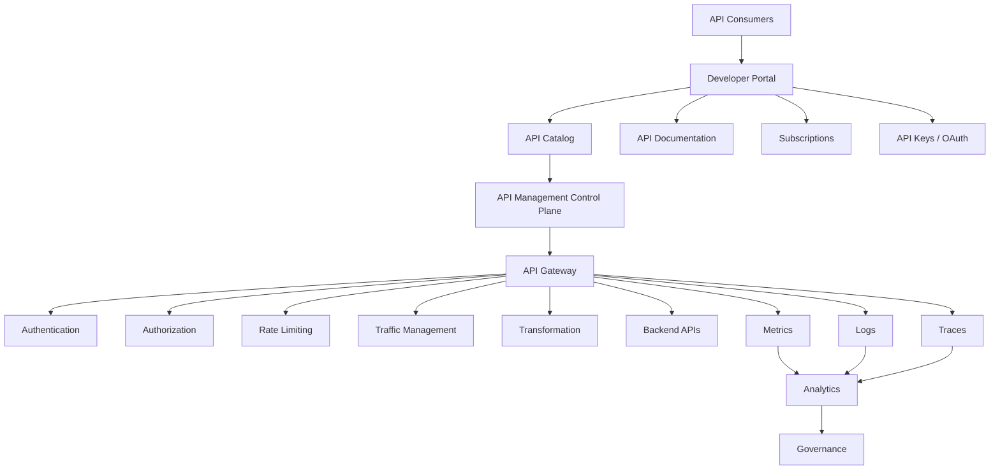
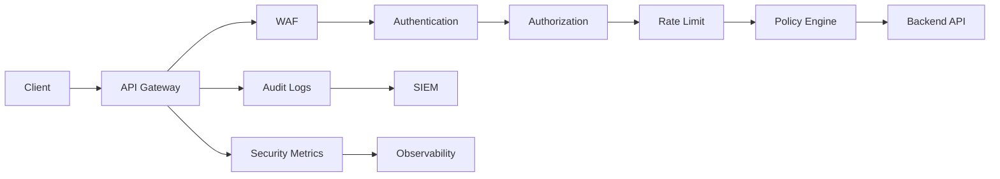
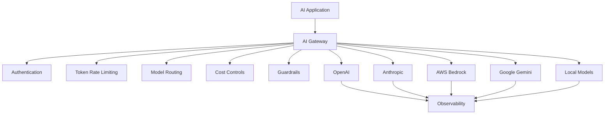

# Awesome-API-Management

# 🔌 Top API Management Platforms & Open-Source API Management


> A curated list of **API Management platforms, API gateways, developer portals, API security platforms, API lifecycle tools and open-source API management software** for designing, publishing, securing, governing, observing and monetizing APIs.


API Management goes far beyond simply routing HTTP requests. A modern API management platform typically combines:


* API Gateway

* API lifecycle management

* API security

* Authentication & authorization

* Rate limiting

* Traffic management

* Developer portals

* API discovery

* API products

* Analytics

* Governance

* Versioning

* Monetization

* Policy enforcement

* Service mesh / Kubernetes integration

* GraphQL management

* Event-driven APIs

* AI / LLM gateway capabilities


This repository focuses primarily on **open-source and self-hostable API management software**, while maintaining a separate list of commercial and hosted platforms such as **Postman, Apigee, Kong Konnect, Stoplight, RapidAPI, Gravitee, DreamFactory, Boomi, MuleSoft, Tyk, Azure API Management, WSO2, IBM API Connect and Akana**.


Modern API management has increasingly split into several related categories:


```text

                         API MANAGEMENT

                               │

       ┌───────────────────────┼────────────────────────┐

       │                       │                        │

       ▼                       ▼                        ▼

   API Gateway            API Lifecycle            Developer

       │                   Management                Portal

       │                       │                        │

       ▼                       ▼                        ▼

  Security                  Design                  Discovery

  Routing                   Testing                 Documentation

  Policies                  Governance              Subscription

  Rate Limits               Versioning              API Products

       │                       │                        │

       └───────────────────────┼────────────────────────┘

                               ▼

                         API Analytics

                               │

                               ▼

                     API Security / Governance

```


The open-source ecosystem is especially strong at the **gateway and runtime layer**, while complete enterprise API management suites often combine gateways with proprietary control planes, portals, analytics and governance.


---


## 📑 Table of Contents


* [☁️ SaaS/Hosted Platforms](#️-saashosted-platforms)

* [🌍 Open-Source](#-open-source)

* [🚪 Open-Source API Gateways](#-open-source-api-gateways)

* [🏢 Full Open-Source API Management Platforms](#-full-open-source-api-management-platforms)

* [📖 Open-Source Developer Portals](#-open-source-developer-portals)

* [📝 Open-Source API Design & Specification Tools](#-open-source-api-design--specification-tools)

* [🔐 Open-Source API Security](#-open-source-api-security)

* [⚡ Open-Source API Traffic Management](#-open-source-api-traffic-management)

* [📊 Open-Source API Analytics & Observability](#-open-source-api-analytics--observability)

* [☸️ Open-Source Kubernetes API Management](#️-open-source-kubernetes-api-management)

* [🤖 Open-Source AI & LLM API Gateways](#-open-source-ai--llm-api-gateways)

* [🌐 Open-Source GraphQL API Management](#-open-source-graphql-api-management)

* [🧩 Open-Source API Gateway Plugins & Extensions](#-open-source-api-gateway-plugins--extensions)

* [🔄 Open-Source API Lifecycle Management](#-open-source-api-lifecycle-management)

* [🧩 Commercial Platform → Open-Source Equivalent](#-commercial-platform--open-source-equivalent)

* [🏗️ API Management Architecture](#️-api-management-architecture)

* [🔄 Open-Source API Management Architecture](#-open-source-api-management-architecture)

* [🔐 API Security Architecture](#-api-security-architecture)

* [📊 API Analytics Architecture](#-api-analytics-architecture)

* [🤖 AI Gateway Architecture](#-ai-gateway-architecture)

* [⚖️ Commercial vs Open-Source](#️-commercial-vs-open-source)

* [🚀 Recommended Open-Source Stacks](#-recommended-open-source-stacks)

* [📊 API Management Technology Comparison](#-api-management-technology-comparison)

* [🎯 Recommended Projects by Use Case](#-recommended-projects-by-use-case)

* [🏢 Building an Apigee Alternative](#-building-an-apigee-alternative)

* [🔌 Building a Kong Alternative](#-building-a-kong-alternative)

* [🌐 Open-Source API Management Landscape](#-open-source-api-management-landscape)

* [🧠 Why Open-Source API Management Matters](#-why-open-source-api-management-matters)

* [🤝 Contributing](#-contributing)

* [⚠️ Disclaimer](#️-disclaimer)


---


# ☁️ SaaS/Hosted Platforms


Commercial API management platforms provide combinations of API gateways, developer portals, analytics, governance, security, lifecycle management and API products.


| Platform                                                                         | Company      | Primary Focus                | Key Capabilities                                                                 |

| -------------------------------------------------------------------------------- | ------------ | ---------------------------- | -------------------------------------------------------------------------------- |

| [Postman](https://www.postman.com/)                                              | Postman      | API platform                 | Design, testing, documentation, collaboration, API governance and API management |

| [Apigee](https://cloud.google.com/apigee)                                        | Google Cloud | Enterprise API management    | Gateway, analytics, security, portals, monetization and governance               |

| [Kong Konnect](https://konghq.com/products/kong-konnect)                         | Kong         | Cloud API management         | Gateway, control plane, security, analytics, portals and AI gateway              |

| [Stoplight](https://stoplight.io/)                                               | SmartBear    | API design & governance      | OpenAPI design, documentation, mocking, governance and collaboration             |

| [RapidAPI](https://rapidapi.com/)                                                | RapidAPI     | API marketplace              | API discovery, marketplace, testing, analytics and management                    |

| [Gravitee](https://www.gravitee.io/)                                             | Gravitee     | API management               | Gateway, event-native APIs, portal, policies, analytics and governance           |

| [DreamFactory](https://www.dreamfactory.com/)                                    | DreamFactory | API generation               | Automatic REST APIs for databases and enterprise systems                         |

| [Boomi API Management](https://boomi.com/platform/api-management/)               | Boomi        | Integration + API management | API lifecycle, integration, gateway, security and governance                     |

| [MuleSoft Anypoint Platform](https://www.mulesoft.com/platform/api)              | Salesforce   | Integration + API management | API design, gateway, integration, governance, analytics and marketplace          |

| [Tyk](https://tyk.io/)                                                           | Tyk          | API management               | Gateway, dashboard, developer portal, analytics and lifecycle management         |

| [Kong](https://konghq.com/)                                                      | Kong         | API gateway + management     | Gateway, plugins, security, observability, service connectivity and AI gateway   |

| [Azure API Management](https://azure.microsoft.com/products/api-management/)     | Microsoft    | Enterprise API management    | Gateway, developer portal, policies, analytics and hybrid deployment             |

| [WSO2 API Manager](https://wso2.com/api-manager/)                                | WSO2         | Full API lifecycle           | Gateway, publisher, developer portal, analytics and governance                   |

| [IBM API Connect](https://www.ibm.com/products/api-connect)                      | IBM          | Enterprise API management    | API lifecycle, gateway, security, analytics and developer portal                 |

| [Akana](https://www.akana.com/)                                                  | Akana        | Enterprise API management    | API gateway, security, lifecycle management and governance                       |

| [AWS API Gateway](https://aws.amazon.com/api-gateway/)                           | AWS          | Cloud API gateway            | REST, HTTP and WebSocket APIs, throttling and AWS integration                    |

| [Red Hat 3scale](https://www.redhat.com/en/technologies/jboss-middleware/3scale) | Red Hat      | API management               | Gateway, developer portal, policies, analytics and API products                  |

| [Axway Amplify](https://www.axway.com/en/products/api-management)                | Axway        | Enterprise API management    | API lifecycle, gateway, governance, security and catalog                         |

| [webMethods API Management](https://www.softwareag.com/)                         | Software AG  | Integration + API management | API gateway, lifecycle, integration and governance                               |

| [Sensedia](https://www.sensedia.com/)                                            | Sensedia     | API management               | Gateway, governance, developer portal and integration                            |

| [Gravitee Cloud](https://www.gravitee.io/)                                       | Gravitee     | Managed API management       | REST, event APIs, gateway and developer portal                                   |


> **Note:** API platforms vary substantially in scope. Some are primarily API lifecycle/developer platforms, while others are gateway-first API management systems. Postman and Stoplight, for example, are especially strong in API development workflows, while Apigee, Kong, Azure APIM, WSO2 and MuleSoft span broader API management capabilities.


---


# 🌍 Open-Source


The open-source API management ecosystem is significantly broader than a simple list of API gateways.


It includes:


```text

                         OPEN-SOURCE API MANAGEMENT

                                     │

       ┌─────────────────────────────┼─────────────────────────────┐

       │                             │                             │

       ▼                             ▼                             ▼

 API Gateways                 Management Suites             API Tooling

       │                             │                             │

       ▼                             ▼                             ▼

 Apache APISIX                 WSO2 API Manager          OpenAPI

 Kong OSS                     Gravitee CE               Swagger UI

 Tyk OSS                      Tyk OSS                   Redoc

 KrakenD                      Kong OSS                  Scalar

 Traefik                       API7                      Spectral

 Envoy                         Apache APISIX

       │

       └──────────────────────────────┬─────────────────────────────┘

                                      ▼

                             Security / Analytics

                                      │

                                      ▼

                            Developer Experience

```


---


# 🚪 Open-Source API Gateways


API gateways are the runtime foundation of many API management systems.


| Project                                                                                 | Description                         | License             |

| --------------------------------------------------------------------------------------- | ----------------------------------- | ------------------- |

| [Apache APISIX](https://github.com/apache/apisix)                                       | Dynamic, cloud-native API gateway   | Apache-2.0          |

| [Kong Gateway](https://github.com/Kong/kong)                                            | Extensible API gateway              | Apache-2.0 OSS core |

| [Tyk](https://github.com/TykTechnologies/tyk)                                           | Go-based API gateway                | MPL-2.0             |

| [Gravitee API Management](https://github.com/gravitee-io/gravitee-api-management)       | API gateway and management platform | Apache-2.0 core     |

| [KrakenD](https://github.com/krakendio/krakend-ce)                                      | High-performance API gateway        | Apache-2.0          |

| [Envoy Proxy](https://github.com/envoyproxy/envoy)                                      | High-performance service proxy      | Apache-2.0          |

| [Traefik](https://github.com/traefik/traefik)                                           | Cloud-native edge router            | MIT                 |

| [Gloo Gateway](https://github.com/kgateway-dev/kgateway)                                | Kubernetes-native gateway           | Apache-2.0          |

| [Zuul](https://github.com/Netflix/zuul)                                                 | Programmable edge service           | Apache-2.0          |

| [Apache APISIX Ingress Controller](https://github.com/apache/apisix-ingress-controller) | Kubernetes integration for APISIX   | Apache-2.0          |

| [Higress](https://github.com/alibaba/higress)                                           | Cloud-native API gateway            | Apache-2.0          |

| [Easegress](https://github.com/megaease/easegress)                                      | Cloud-native traffic orchestration  | Apache-2.0          |

| [NGINX](https://github.com/nginx/nginx)                                                 | Reverse proxy / gateway foundation  | BSD-2-Clause        |

| [Caddy](https://github.com/caddyserver/caddy)                                           | Extensible web server / proxy       | Apache-2.0          |


Apache APISIX is a particularly complete open-source gateway, with dynamic routing, load balancing, authentication, traffic management, observability and a large plugin ecosystem. Its current project is an Apache Software Foundation top-level project under Apache-2.0.


---


# 🏢 Full Open-Source API Management Platforms


A gateway alone is not necessarily a complete API management platform.


Full API management generally adds:


```text

Gateway

   +

API Publisher

   +

Developer Portal

   +

API Catalog

   +

Subscriptions

   +

Policies

   +

Analytics

   +

Governance

   +

Lifecycle Management

```


| Project                                                            | Gateway | Portal | Management | Analytics | Governance |

| ------------------------------------------------------------------ | :-----: | :----: | :--------: | :-------: | :--------: |

| [WSO2 API Manager](https://github.com/wso2/product-apim)           |    ✅    |    ✅   |      ✅     |     ✅     |      ✅     |

| [Gravitee](https://github.com/gravitee-io/gravitee-api-management) |    ✅    |    ✅   |      ✅     |     ✅     |      ✅     |

| [Kong](https://github.com/Kong/kong)                               |    ✅    |   ⚠️   |     ⚠️     |     ⚠️    |     ⚠️     |

| [Tyk](https://github.com/TykTechnologies/tyk)                      |    ✅    |   ⚠️   |     ⚠️     |     ⚠️    |     ⚠️     |

| [Apache APISIX](https://github.com/apache/apisix)                  |    ✅    |   ⚠️   |     ⚠️     |     ⚠️    |     ⚠️     |

| [API7](https://api7.ai/)                                           |  APISIX |    ✅   |      ✅     |     ✅     |      ✅     |

| [Gloo Gateway](https://github.com/kgateway-dev/kgateway)           |    ✅    |   ⚠️   |     ⚠️     |     ⚠️    |     ⚠️     |


> ⚠️ indicates that functionality may require separate components, integrations or commercial editions rather than being entirely contained in the open-source gateway.


Current comparisons distinguish these licensing models carefully: WSO2 API Manager is positioned as a fully open-source full-lifecycle suite, while Kong, Tyk and Gravitee combine open-source gateway/community components with commercial management capabilities.


---


# 🏆 WSO2 API Manager


[WSO2 API Manager](https://github.com/wso2/product-apim) is one of the closest open-source projects to a traditional enterprise API management suite.


It includes concepts such as:


* API Gateway

* API Publisher

* Developer Portal

* API subscriptions

* Authentication

* Authorization

* Rate limiting

* Policies

* Analytics

* API lifecycle management

* API governance


```text

                  WSO2 API Manager

                         │

        ┌────────────────┼────────────────┐

        ▼                ▼                ▼

    Publisher        Developer Portal   Gateway

        │                │                │

        └────────────────┼────────────────┘

                         ▼

                     Analytics

                         │

                         ▼

                     Governance

```


WSO2 describes its API platform as fully open source, making it one of the strongest candidates when the requirement is a **full API management suite rather than merely an API gateway**.


---


# 🌊 Gravitee


[Gravitee](https://github.com/gravitee-io/gravitee-api-management) provides an open-source API management ecosystem with a particular emphasis on both REST and event-driven APIs.


Useful for:


* REST APIs

* Kafka

* MQTT

* Event-driven APIs

* API Gateway

* Developer Portal

* API policies

* API lifecycle

* API governance


Gravitee is especially interesting for organizations managing APIs alongside event-driven architectures. Current comparisons identify its community/core gateway as open source while distinguishing commercial/enterprise functionality.


---


# 🚪 Apache APISIX


[Apache APISIX](https://github.com/apache/apisix) is one of the strongest open-source API gateway foundations.


Architecture:


```text

                     Apache APISIX

                           │

                           ▼

                       NGINX/Lua

                           │

                           ▼

                         etcd

                           │

             ┌─────────────┼─────────────┐

             ▼             ▼             ▼

          Routing      Plugins       Policies

             │             │             │

             └─────────────┼─────────────┘

                           ▼

                        Services

```


Capabilities include:


* Dynamic routing

* Load balancing

* Authentication

* JWT

* OIDC

* Rate limiting

* Circuit breaking

* Canary releases

* Observability

* gRPC

* WebSockets

* MQTT

* Kubernetes

* AI gateway functionality


Apache APISIX currently advertises more than 100 plugins and supports both conventional API traffic and AI/LLM gateway workloads.


---


# 🧱 Kong Gateway


[Kong Gateway](https://github.com/Kong/kong) is one of the most widely used open-source API gateway projects.


It provides:


* Routing

* Authentication

* Rate limiting

* Transformations

* Logging

* Metrics

* Load balancing

* Plugin architecture

* Service discovery

* Kubernetes integration


Kong's architecture can operate using database-backed, DB-less or hybrid approaches.


```text

                    Kong Gateway

                         │

             ┌───────────┼───────────┐

             ▼           ▼           ▼

          Routes      Plugins     Policies

             │           │           │

             └───────────┼───────────┘

                         ▼

                     Upstream

```


---


# 🐝 Tyk


[Tyk](https://github.com/TykTechnologies/tyk) is a Go-based API gateway with an open-source gateway and additional management components.


Core capabilities include:


* API gateway

* Authentication

* Rate limiting

* API versioning

* GraphQL

* Service discovery

* Middleware

* Observability

* Developer portal integrations


Tyk's current ecosystem combines an open-source gateway with commercial management functionality, so users should distinguish the OSS gateway from paid components.


---


# 📖 Open-Source Developer Portals


A developer portal is an essential component of API management.


```text

                 API Catalog

                     │

        ┌────────────┼────────────┐

        ▼            ▼            ▼

 Documentation    Try API      Credentials

        │            │            │

        └────────────┼────────────┘

                     ▼

                 Subscribe

```


| Project                                                                             | Description                            |

| ----------------------------------------------------------------------------------- | -------------------------------------- |

| [WSO2 Developer Portal](https://github.com/wso2/product-apim)                       | API discovery and subscriptions        |

| [Gravitee Developer Portal](https://github.com/gravitee-io/gravitee-api-management) | API catalog and consumption            |

| [Swagger UI](https://github.com/swagger-api/swagger-ui)                             | Interactive OpenAPI documentation      |

| [Redoc](https://github.com/Redocly/redoc)                                           | OpenAPI documentation                  |

| [Scalar](https://github.com/scalar/scalar)                                          | Modern API reference and documentation |

| [Docusaurus](https://github.com/facebook/docusaurus)                                | Documentation websites                 |

| [MkDocs](https://github.com/mkdocs/mkdocs)                                          | Documentation generator                |

| [Backstage](https://github.com/backstage/backstage)                                 | Developer portal / service catalog     |

| [Port](https://www.getport.io/)                                                     | Developer portal platform              |

| [OpenAPI Explorer](https://github.com/rohit-gohri/redoc)                            | OpenAPI exploration tooling            |


A powerful open-source approach is to combine an API gateway with **Backstage + Swagger UI/Redoc/Scalar** to build a customized internal API portal.


---


# 📝 Open-Source API Design & Specification Tools


API management begins before deployment.


| Project                                                                | Primary Role                      |

| ---------------------------------------------------------------------- | --------------------------------- |

| [OpenAPI Specification](https://github.com/OAI/OpenAPI-Specification)  | API contract standard             |

| [Swagger UI](https://github.com/swagger-api/swagger-ui)                | Interactive documentation         |

| [Swagger Editor](https://github.com/swagger-api/swagger-editor)        | OpenAPI editing                   |

| [Redoc](https://github.com/Redocly/redoc)                              | API documentation                 |

| [Scalar](https://github.com/scalar/scalar)                             | API references                    |

| [Spectral](https://github.com/stoplightio/spectral)                    | API linting and governance        |

| [Dredd](https://github.com/apiaryio/dredd)                             | API contract testing              |

| [Prism](https://github.com/stoplightio/prism)                          | Mocking and validation            |

| [Schemathesis](https://github.com/schemathesis/schemathesis)           | Property-based API testing        |

| [RESTler](https://github.com/microsoft/restler-fuzzer)                 | API fuzz testing                  |

| [OpenAPI Generator](https://github.com/OpenAPITools/openapi-generator) | SDK/server generation             |

| [Kiota](https://github.com/microsoft/kiota)                            | API client generation             |

| [openapi-diff](https://github.com/Tufin/oasdiff)                       | OpenAPI breaking-change detection |


---


# 🔐 Open-Source API Security


API management and API security are closely related but not identical.


Useful projects include:


| Project                                                         | Role                                   |

| --------------------------------------------------------------- | -------------------------------------- |

| [Keycloak](https://github.com/keycloak/keycloak)                | Identity and access management         |

| [Open Policy Agent](https://github.com/open-policy-agent/opa)   | Policy engine                          |

| [Envoy](https://github.com/envoyproxy/envoy)                    | Security-aware proxy                   |

| [Apache APISIX](https://github.com/apache/apisix)               | Gateway security policies              |

| [Kong](https://github.com/Kong/kong)                            | Gateway authentication / authorization |

| [Tyk](https://github.com/TykTechnologies/tyk)                   | API authentication and policies        |

| [Coraza](https://github.com/corazawaf/coraza)                   | Open-source WAF                        |

| [ModSecurity](https://github.com/owasp-modsecurity/ModSecurity) | Web application firewall               |

| [OWASP CRS](https://github.com/coreruleset/coreruleset)         | WAF ruleset                            |

| [oauth2-proxy](https://github.com/oauth2-proxy/oauth2-proxy)    | Authentication proxy                   |

| [SPIRE](https://github.com/spiffe/spire)                        | Workload identity                      |

| [cert-manager](https://github.com/cert-manager/cert-manager)    | TLS certificate automation             |


---


# ⚡ Open-Source API Traffic Management


Modern API gateways commonly implement:


```text

Rate Limiting

     │

     ├── Requests / second

     ├── Requests / minute

     ├── Token limits

     └── Consumer quotas


Traffic Control

     │

     ├── Load balancing

     ├── Retries

     ├── Circuit breaking

     ├── Timeouts

     └── Failover


Routing

     │

     ├── Host-based

     ├── Path-based

     ├── Header-based

     ├── Canary

     └── Weighted

```


Strong open-source choices:


| Project       | Strength                     |

| ------------- | ---------------------------- |

| Apache APISIX | Dynamic traffic management   |

| Kong          | Mature plugin ecosystem      |

| Envoy         | Advanced proxying            |

| Tyk           | API-specific policies        |

| Traefik       | Cloud-native routing         |

| KrakenD       | High-performance aggregation |

| Gloo Gateway  | Kubernetes-native gateway    |

| Higress       | Cloud-native gateway         |

| NGINX         | Mature reverse proxy         |


---


# 📊 Open-Source API Analytics & Observability


API management needs visibility into:


* Requests

* Latency

* Errors

* Consumers

* API versions

* Endpoints

* Status codes

* Traffic

* Rate limits

* Authentication failures

* Upstream failures


| Project                                                                    | Role                |

| -------------------------------------------------------------------------- | ------------------- |

| [Prometheus](https://github.com/prometheus/prometheus)                     | Metrics             |

| [Grafana](https://github.com/grafana/grafana)                              | Dashboards          |

| [OpenTelemetry](https://github.com/open-telemetry/opentelemetry-collector) | Telemetry           |

| [Jaeger](https://github.com/jaegertracing/jaeger)                          | Distributed tracing |

| [Zipkin](https://github.com/openzipkin/zipkin)                             | Distributed tracing |

| [Apache SkyWalking](https://github.com/apache/skywalking)                  | Observability       |

| [Loki](https://github.com/grafana/loki)                                    | Log aggregation     |

| [ClickHouse](https://github.com/ClickHouse/ClickHouse)                     | Analytics database  |

| [OpenSearch](https://github.com/opensearch-project/OpenSearch)             | Search / analytics  |

| [VictoriaMetrics](https://github.com/VictoriaMetrics/VictoriaMetrics)      | Metrics storage     |


Example:


```text

                       API Gateway

                            │

             ┌──────────────┼──────────────┐

             ▼              ▼              ▼

          Metrics         Logs          Traces

             │              │              │

             ▼              ▼              ▼

        Prometheus         Loki          Jaeger

             │              │              │

             └──────────────┼──────────────┘

                            ▼

                         Grafana

```


---


# ☸️ Open-Source Kubernetes API Management


Kubernetes has become a major deployment environment for API gateways.


| Project       | Kubernetes Capability            |

| ------------- | -------------------------------- |

| Apache APISIX | Ingress Controller / Gateway API |

| Kong          | Kong Ingress Controller          |

| Envoy Gateway | Kubernetes Gateway API           |

| Traefik       | Kubernetes-native routing        |

| Gloo Gateway  | Kubernetes Gateway API           |

| Tyk           | Kubernetes integration           |

| Gravitee      | Kubernetes deployment            |

| NGINX Ingress | Kubernetes ingress               |

| HAProxy       | Kubernetes ingress               |

| Higress       | Kubernetes-native gateway        |


A modern Kubernetes API management architecture:


```text

                     Internet

                        │

                        ▼

                Cloud Load Balancer

                        │

                        ▼

                  API Gateway

                        │

               ┌────────┼────────┐

               ▼        ▼        ▼

             Service  Service  Service

               │        │        │

               └────────┼────────┘

                        ▼

                    Kubernetes

```


---


# 🤖 Open-Source AI & LLM API Gateways


API management is increasingly expanding into **AI Gateway** functionality.


Capabilities include:


* LLM provider routing

* Model routing

* Token-based rate limiting

* Cost controls

* Provider fallback

* Prompt security

* AI observability

* Model access policies

* MCP governance


| Project                                                      | AI Gateway Capability                           |

| ------------------------------------------------------------ | ----------------------------------------------- |

| [Apache APISIX](https://github.com/apache/apisix)            | LLM proxy, routing, token limits and AI plugins |

| [Kong AI Gateway](https://github.com/Kong/kong)              | LLM traffic management                          |

| [LiteLLM](https://github.com/BerriAI/litellm)                | Unified LLM gateway                             |

| [Envoy AI Gateway](https://github.com/envoyproxy/ai-gateway) | Kubernetes-native AI gateway                    |

| [Portkey](https://github.com/Portkey-AI/gateway)             | LLM gateway                                     |

| [TrueFoundry](https://github.com/truefoundry)                | AI infrastructure / gateway                     |

| [Higress](https://github.com/alibaba/higress)                | AI gateway capabilities                         |

| [Helicone](https://github.com/Helicone/helicone)             | LLM observability / gateway                     |

| [OpenRouter](https://openrouter.ai/)                         | Hosted multi-model routing                      |


Apache APISIX currently positions itself as both an API gateway and AI gateway, including LLM provider routing, token rate limiting, retries/fallbacks and MCP-related functionality.


---


# 🌐 Open-Source GraphQL API Management


GraphQL introduces a different API management model.


| Project                                                      | Role                            |

| ------------------------------------------------------------ | ------------------------------- |

| [Apollo Router](https://github.com/apollographql/router)     | GraphQL federation gateway      |

| [GraphQL Yoga](https://github.com/graphql-hive/graphql-yoga) | GraphQL server                  |

| [GraphQL Mesh](https://github.com/ardatan/graphql-mesh)      | API federation / transformation |

| [Hasura](https://github.com/hasura/graphql-engine)           | GraphQL data API                |

| [GraphQL Hive](https://github.com/graphql-hive/console)      | GraphQL registry / analytics    |

| [Lago](https://github.com/getlago/lago)                      | Usage-based billing for APIs    |

| [Tyk](https://github.com/TykTechnologies/tyk)                | GraphQL gateway capabilities    |


---


# 🧩 Open-Source API Gateway Plugins & Extensions


A major advantage of open-source API gateways is extensibility.


Typical plugins include:


```text

Authentication

├── API Keys

├── JWT

├── OAuth2

├── OIDC

└── mTLS


Security

├── WAF

├── IP filtering

├── Bot protection

└── Threat detection


Traffic

├── Rate limiting

├── Quotas

├── Load balancing

├── Retries

└── Circuit breaking


Transformation

├── Header rewriting

├── Request transformation

├── Response transformation

└── Protocol translation


Observability

├── Prometheus

├── OpenTelemetry

├── Jaeger

├── Zipkin

└── Logging

```


Apache APISIX, Kong, Envoy and Tyk all expose extensibility mechanisms, although their plugin models and licensing differ.


---


# 🔄 Open-Source API Lifecycle Management


API management should ideally cover the complete lifecycle:


```text

Design

  │

  ▼

Review

  │

  ▼

Lint

  │

  ▼

Mock

  │

  ▼

Test

  │

  ▼

Deploy

  │

  ▼

Publish

  │

  ▼

Monitor

  │

  ▼

Govern

  │

  ▼

Version

  │

  ▼

Deprecate

  │

  ▼

Retire

```


Useful open-source projects:


| Lifecycle Stage | Projects                           |

| --------------- | ---------------------------------- |

| Design          | Swagger Editor, Stoplight Spectral |

| Specification   | OpenAPI                            |

| Linting         | Spectral                           |

| Mocking         | Prism                              |

| Documentation   | Swagger UI, Redoc, Scalar          |

| Testing         | Dredd, Schemathesis, RESTler       |

| SDK Generation  | OpenAPI Generator, Kiota           |

| Gateway         | APISIX, Kong, Tyk, Gravitee        |

| Security        | Keycloak, OPA, Coraza              |

| Analytics       | Prometheus, Grafana, OpenTelemetry |

| Portal          | Backstage, WSO2, Gravitee          |

| Deployment      | Kubernetes, Helm, Argo CD          |

| CI/CD           | GitHub Actions, GitLab CI, Tekton  |


---


# 🧩 Commercial Platform → Open-Source Equivalent


| Commercial Platform           | Open-Source Equivalent / Building Blocks                             |

| ----------------------------- | -------------------------------------------------------------------- |

| **Postman**                   | OpenAPI + Swagger Editor + Swagger UI + Prism + Schemathesis + Dredd |

| **Apigee**                    | WSO2 API Manager / Gravitee + APISIX/Kong + Prometheus/Grafana       |

| **Kong Konnect**              | Kong OSS + decK + Kubernetes + Prometheus/Grafana                    |

| **Stoplight**                 | OpenAPI + Spectral + Prism + Redoc/Scalar                            |

| **RapidAPI**                  | API gateway + Backstage + OpenAPI + developer portal                 |

| **Gravitee**                  | Gravitee Community Edition                                           |

| **DreamFactory**              | Hasura + PostgREST + Kong/APISIX                                     |

| **Boomi API Management**      | WSO2 + Apache Camel + APISIX                                         |

| **MuleSoft Anypoint**         | WSO2 + Apache Camel + APISIX + Backstage                             |

| **Tyk**                       | Tyk OSS                                                              |

| **Kong**                      | Kong OSS                                                             |

| **Azure API Management**      | APISIX / Kong / WSO2 + Kubernetes                                    |

| **WSO2**                      | WSO2 API Manager                                                     |

| **IBM API Connect**           | WSO2 + APISIX/Kong + OpenAPI tooling                                 |

| **Akana**                     | WSO2 + APISIX/Kong + OPA                                             |

| **AWS API Gateway**           | APISIX / Kong / Envoy / Traefik                                      |

| **Red Hat 3scale**            | APISIX / WSO2 / Kong                                                 |

| **Axway Amplify**             | WSO2 + Backstage + OpenAPI tooling                                   |

| **webMethods API Management** | WSO2 + Apache Camel + APISIX                                         |

| **API Gateway + Portal**      | APISIX + Backstage + Swagger UI                                      |

| **API Gateway + Analytics**   | APISIX/Kong + Prometheus + Grafana                                   |

| **API Security Gateway**      | APISIX/Kong + Keycloak + OPA + Coraza                                |

| **AI API Gateway**            | APISIX/Kong + LiteLLM + OpenTelemetry                                |


---


# 🏗️ API Management Architecture


A complete API management platform can be visualized as:





---


# 🔄 Open-Source API Management Architecture


A practical self-hosted stack:


```text

                           API CONSUMERS

                                │

                                ▼

                         Developer Portal

                                │

                     ┌──────────┴──────────┐

                     │                     │

                     ▼                     ▼

                API Catalog           Documentation

                     │                     │

                     └──────────┬──────────┘

                                ▼

                         Control Plane

                                │

                                ▼

                         API Gateway

                                │

              ┌─────────────────┼─────────────────┐

              ▼                 ▼                 ▼

          Security          Policies          Routing

              │                 │                 │

              └─────────────────┼─────────────────┘

                                ▼

                           Backend APIs

                                │

                   ┌────────────┼────────────┐

                   ▼            ▼            ▼

                Metrics       Logs        Traces

                   │            │            │

                   └────────────┼────────────┘

                                ▼

                           Observability

```


---


# 🔐 API Security Architecture





Possible open-source implementation:


```text

API Gateway

    │

    ├── Apache APISIX / Kong

    │

    ├── Keycloak

    │

    ├── Open Policy Agent

    │

    ├── Coraza / OWASP CRS

    │

    └── OpenTelemetry

```


---


# 📊 API Analytics Architecture


```text

                         API Gateway

                              │

             ┌────────────────┼────────────────┐

             ▼                ▼                ▼

          Metrics            Logs             Traces

             │                │                │

             ▼                ▼                ▼

        Prometheus           Loki             Jaeger

             │                │                │

             └────────────────┼────────────────┘

                              ▼

                           Grafana

                              │

               ┌──────────────┼──────────────┐

               ▼              ▼              ▼

           Dashboards       Alerts        Reports

```


For high-volume analytics:


```text

API Gateway

    │

    ▼

Kafka

    │

    ▼

ClickHouse

    │

    ▼

Grafana

```


---


# 🤖 AI Gateway Architecture


The API management layer is increasingly becoming the control plane for AI APIs.





Potential open-source stack:


```text

Apache APISIX

      +

LiteLLM

      +

OpenTelemetry

      +

Prometheus

      +

Grafana

      +

OPA

```


---


# 🏢 Building an Apigee Alternative


Apigee-style API management is much more than an API gateway.


A self-hosted architecture could combine:


```text

                    API MANAGEMENT

                          │

       ┌──────────────────┼──────────────────┐

       │                  │                  │

       ▼                  ▼                  ▼

   API Portal          Control Plane      Analytics

       │                  │                  │

       ▼                  ▼                  ▼

   Backstage           WSO2 / APISIX      Grafana

       │                  │                  │

       └──────────────────┼──────────────────┘

                          ▼

                     API Gateway

                          │

                    Apache APISIX

                          │

             ┌────────────┼────────────┐

             ▼            ▼            ▼

          Services      GraphQL       gRPC

```


### Suggested Components


```text

API Management       → WSO2 API Manager

Gateway               → Apache APISIX

Developer Portal      → Backstage

API Documentation     → Redoc / Scalar

API Specification     → OpenAPI

API Linting           → Spectral

API Mocking           → Prism

API Testing           → Schemathesis

Identity              → Keycloak

Policy                → OPA

WAF                   → Coraza + OWASP CRS

Metrics               → Prometheus

Dashboards            → Grafana

Tracing               → OpenTelemetry + Jaeger

Logs                  → Loki

```


---


# 🔌 Building a Kong Alternative


A gateway-first alternative can be much simpler:


```text

                    API Consumers

                          │

                          ▼

                    Apache APISIX

                          │

            ┌─────────────┼─────────────┐

            ▼             ▼             ▼

        Security       Policies       Routing

            │             │             │

            └─────────────┼─────────────┘

                          ▼

                       Services

                          │

            ┌─────────────┼─────────────┐

            ▼             ▼             ▼

       Prometheus       Loki          Jaeger

            │             │             │

            └─────────────┼─────────────┘

                          ▼

                       Grafana

```


This is a strong architecture when the primary requirement is:


* API gateway

* Routing

* Security

* Rate limiting

* Traffic control

* Observability

* Kubernetes

* High performance


rather than a large enterprise API lifecycle suite.


---


# 🏗️ Building a Postman-Style API Platform


Postman covers a different portion of the API lifecycle than traditional API gateways.


An open-source equivalent can be assembled as:


```text

                         API Platform

                              │

       ┌──────────────────────┼──────────────────────┐

       ▼                      ▼                      ▼

    API Design             API Testing          Documentation

       │                      │                      │

       ▼                      ▼                      ▼

 Swagger Editor          Schemathesis            Swagger UI

 Spectral                Dredd                    Redoc

 OpenAPI                 RESTler                  Scalar

       │                      │                      │

       └──────────────────────┼──────────────────────┘

                              ▼

                         API Gateway

                              │

                              ▼

                         APISIX / Kong

```


---


# 🧪 Open-Source API Testing Stack


```text

OpenAPI Specification

        │

        ▼

    Spectral

        │

        ▼

      Prism

        │

        ├── Mock Server

        │

        ▼

   Schemathesis

        │

        ▼

    Dredd / RESTler

        │

        ▼

   CI/CD Pipeline

```


Useful for creating a fully open-source alternative to the API testing portion of Postman.


---


# 📦 Open-Source API Developer Platform


A complete developer-facing platform can be assembled from:


```text

┌─────────────────────────────────────────────┐

│              Developer Portal               │

│                  Backstage                  │

├─────────────────────────────────────────────┤

│             API Documentation               │

│          Swagger UI / Redoc / Scalar        │

├─────────────────────────────────────────────┤

│               API Catalog                   │

│                  OpenAPI                    │

├─────────────────────────────────────────────┤

│             API Governance                  │

│                 Spectral                    │

├─────────────────────────────────────────────┤

│              API Mocking                    │

│                  Prism                     │

├─────────────────────────────────────────────┤

│              API Testing                    │

│        Schemathesis / Dredd / RESTler       │

├─────────────────────────────────────────────┤

│              API Gateway                   │

│            Apache APISIX / Kong             │

├─────────────────────────────────────────────┤

│             Observability                  │

│      Prometheus / Grafana / OpenTelemetry  │

└─────────────────────────────────────────────┘

```


---


# ⚖️ Commercial vs Open-Source


| Capability                | Commercial API Management | Open-Source Stack        |

| ------------------------- | ------------------------- | ------------------------ |

| API Gateway               | ✅                         | ✅                        |

| API Routing               | ✅                         | ✅                        |

| Authentication            | ✅                         | ✅                        |

| Authorization             | ✅                         | ✅                        |

| Rate Limiting             | ✅                         | ✅                        |

| Traffic Management        | ✅                         | ✅                        |

| API Documentation         | ✅                         | ✅                        |

| Developer Portal          | ✅                         | ✅                        |

| API Catalog               | ✅                         | ✅                        |

| API Analytics             | ✅                         | ✅                        |

| API Governance            | ✅                         | ✅                        |

| API Monetization          | ✅                         | ⚠️ Build / integrate     |

| API Marketplace           | ✅                         | ⚠️ Build / integrate     |

| API Lifecycle             | ✅                         | ✅                        |

| OpenAPI                   | ✅                         | ✅                        |

| GraphQL                   | ✅                         | ✅                        |

| gRPC                      | ✅                         | ✅                        |

| WebSockets                | ✅                         | ✅                        |

| Event APIs                | ✅                         | ✅                        |

| AI Gateway                | Increasingly              | ✅                        |

| Kubernetes                | ✅                         | ✅                        |

| Multi-cloud               | ✅                         | ✅                        |

| Self-hosting              | Depends on vendor         | ✅                        |

| Source Code               | Usually proprietary       | ✅                        |

| Customization             | Medium                    | Very High                |

| Vendor Lock-in            | Higher                    | Lower                    |

| Infrastructure Management | Managed / hybrid          | Self-managed             |

| Support                   | Vendor                    | Community / paid support |

| Compliance                | Vendor capabilities       | Your responsibility      |

| Total Platform Assembly   | Simple                    | More complex             |


---


# 🚀 Recommended Open-Source Stacks


## 🏆 1. Full Enterprise API Management


```text

WSO2 API Manager

        +

Keycloak

        +

OpenTelemetry

        +

Prometheus

        +

Grafana

```


Best when you want the closest open-source equivalent to a traditional enterprise API management suite.


---


## ⚡ 2. High-Performance Cloud-Native


```text

Apache APISIX

      +

etcd

      +

Kubernetes

      +

Prometheus

      +

Grafana

      +

OpenTelemetry

```


Apache APISIX is particularly suited to dynamic, Kubernetes-oriented API gateway deployments.


---


## 🏢 3. Enterprise Gateway + Portal


```text

Apache APISIX

      +

Backstage

      +

Swagger UI / Redoc

      +

Keycloak

      +

OPA

      +

Grafana

```


---


## 🌊 4. Event-Driven API Management


```text

Gravitee

   +

Kafka

   +

MQTT

   +

OpenTelemetry

   +

Grafana

```


Gravitee is particularly attractive when API management includes both traditional REST APIs and event-driven interfaces.


---


## 🐝 5. Kong-Style Gateway


```text

Kong OSS

    +

decK

    +

Kubernetes

    +

Prometheus

    +

Grafana

    +

OpenTelemetry

```


---


## 🧪 6. Postman-Style API Development Platform


```text

OpenAPI

   +

Swagger Editor

   +

Spectral

   +

Prism

   +

Schemathesis

   +

Swagger UI / Scalar

   +

Backstage

```


---


## 🤖 7. AI API Management


```text

Apache APISIX

      +

LiteLLM

      +

OpenTelemetry

      +

Prometheus

      +

Grafana

      +

OPA

```


---


# 📊 API Management Technology Comparison


| Project              | Gateway | Full APIM | Portal | Analytics | Kubernetes | AI Gateway | Open Source |

| -------------------- | :-----: | :-------: | :----: | :-------: | :--------: | :--------: | :---------: |

| **Apache APISIX**    |    ✅    |     ⚠️    |   ⚠️   |     ⚠️    |      ✅     |      ✅     |      ✅      |

| **Kong OSS**         |    ✅    |     ⚠️    |   ⚠️   |     ⚠️    |      ✅     |      ✅     |      ✅      |

| **Tyk OSS**          |    ✅    |     ⚠️    |   ⚠️   |     ⚠️    |      ✅     |     ⚠️     |      ✅      |

| **Gravitee CE**      |    ✅    |     ✅     |    ✅   |     ⚠️    |      ✅     |     ⚠️     |      ✅      |

| **WSO2 API Manager** |    ✅    |     ✅     |    ✅   |     ✅     |      ✅     |     ⚠️     |      ✅      |

| **KrakenD CE**       |    ✅    |     ⚠️    |    ❌   |     ⚠️    |      ✅     |     ⚠️     |      ✅      |

| **Envoy**            |    ✅    |     ❌     |    ❌   |     ⚠️    |      ✅     |      ✅     |      ✅      |

| **Traefik**          |    ✅    |     ⚠️    |    ❌   |     ⚠️    |      ✅     |     ⚠️     |      ✅      |

| **Gloo Gateway**     |    ✅    |     ⚠️    |    ❌   |     ⚠️    |      ✅     |     ⚠️     |      ✅      |

| **Higress**          |    ✅    |     ⚠️    |   ⚠️   |     ⚠️    |      ✅     |      ✅     |      ✅      |

| **Apache Camel**     |    ⚠️   |     ❌     |    ❌   |     ❌     |      ✅     |     ⚠️     |      ✅      |

| **Backstage**        |    ❌    |     ⚠️    |    ✅   |     ⚠️    |      ✅     |     ⚠️     |      ✅      |

| **Swagger UI**       |    ❌    |     ❌     |    ✅   |     ❌     |      ❌     |      ❌     |      ✅      |

| **Spectral**         |    ❌    |     ❌     |    ❌   |     ❌     |      ❌     |      ❌     |      ✅      |


> **Important:** "Open Source" does not mean that every commercial feature surrounding a project is open source. Kong, Tyk and Gravitee in particular have distinctions between their open-source components and commercial offerings. WSO2 API Manager is a notable option for a more complete open-source API management suite.


---


# 🎯 Recommended Projects by Use Case


| Use Case                                 | Recommended Starting Point              |

| ---------------------------------------- | --------------------------------------- |

| Best complete open-source API management | **WSO2 API Manager**                    |

| Best cloud-native API gateway            | **Apache APISIX**                       |

| Mature gateway ecosystem                 | **Kong OSS**                            |

| Go-based API gateway                     | **Tyk**                                 |

| REST + event API management              | **Gravitee**                            |

| Lightweight high-performance gateway     | **KrakenD**                             |

| Service-proxy foundation                 | **Envoy**                               |

| Kubernetes-native gateway                | **Envoy Gateway / APISIX / Gloo**       |

| Cloud-native routing                     | **Traefik**                             |

| API documentation                        | **Swagger UI / Redoc / Scalar**         |

| API design                               | **Swagger Editor + OpenAPI**            |

| API governance                           | **Spectral**                            |

| API mocking                              | **Prism**                               |

| API contract testing                     | **Dredd / Schemathesis**                |

| API fuzz testing                         | **RESTler**                             |

| API client generation                    | **OpenAPI Generator / Kiota**           |

| Developer portal                         | **Backstage**                           |

| Identity                                 | **Keycloak**                            |

| Policy engine                            | **Open Policy Agent**                   |

| WAF                                      | **Coraza + OWASP CRS**                  |

| API metrics                              | **Prometheus**                          |

| API dashboards                           | **Grafana**                             |

| Distributed tracing                      | **OpenTelemetry + Jaeger**              |

| Log aggregation                          | **Loki**                                |

| AI gateway                               | **APISIX / LiteLLM / Envoy AI Gateway** |

| GraphQL gateway                          | **Apollo Router / GraphQL Mesh**        |

| Full API lifecycle                       | **WSO2 + OpenAPI tooling**              |


---


# 🌐 Open-Source API Management Landscape


```mermaid

mindmap

  root((API Management))

    API Gateways

      Apache APISIX

      Kong

      Tyk

      Gravitee

      KrakenD

      Envoy

      Traefik

      Gloo

      Higress

    Full API Management

      WSO2

      Gravitee

      Tyk

      Kong

      API7

    API Design

      OpenAPI

      Swagger Editor

      Spectral

      Prism

    Documentation

      Swagger UI

      Redoc

      Scalar

    Developer Portals

      Backstage

      WSO2

      Gravitee

    API Testing

      Schemathesis

      Dredd

      RESTler

    Security

      Keycloak

      OPA

      Coraza

      ModSecurity

      OWASP CRS

    Observability

      Prometheus

      Grafana

      OpenTelemetry

      Jaeger

      Loki

      ClickHouse

    Kubernetes

      APISIX

      Kong

      Envoy Gateway

      Gloo

      Traefik

      Tyk

    AI Gateway

      APISIX

      Kong

      LiteLLM

      Envoy AI Gateway

      Higress

    GraphQL

      Apollo Router

      GraphQL Mesh

      Hasura

      GraphQL Hive

```


---


# 🧠 Why Open-Source API Management Matters


API management sits directly on the boundary between internal systems and external consumers.


A proprietary platform typically looks like:


```text

                     Your Applications

                            │

                            ▼

                   ┌─────────────────┐

                   │  API Management │

                   │     Vendor      │

                   └────────┬────────┘

                            │

                            ▼

                         APIs

```


An open-source architecture allows the organization to own the individual layers:


```text

                     Your Applications

                            │

                            ▼

                       Your Portal

                        Backstage

                            │

                            ▼

                       Your Gateway

                     Apache APISIX

                            │

                            ▼

                     Your Security

                 Keycloak + OPA + WAF

                            │

                            ▼

                    Your Observability

             Prometheus + Grafana + OTel

                            │

                            ▼

                         APIs

```


This provides:


* Greater control

* Self-hosting

* Data sovereignty

* Custom policies

* Lower vendor lock-in

* Kubernetes portability

* Custom integrations

* Ability to modify source code

* Ability to combine best-of-breed components

* Air-gapped deployment options

* Greater control over API governance


The trade-off is that an open-source stack transfers more responsibility to the platform team.


---


# 🔥 The Open-Source API Management Stack


A modern open-source API platform can be assembled into the following layers:


```text

┌────────────────────────────────────────────────────┐

│                Developer Experience                │

│         Backstage • Swagger UI • Scalar            │

├────────────────────────────────────────────────────┤

│                API Lifecycle                       │

│       OpenAPI • Spectral • Prism • Dredd           │

├────────────────────────────────────────────────────┤

│                API Management                      │

│             WSO2 • Gravitee • Tyk                  │

├────────────────────────────────────────────────────┤

│                API Gateway                         │

│       APISIX • Kong • Envoy • KrakenD              │

├────────────────────────────────────────────────────┤

│                API Security                        │

│       Keycloak • OPA • Coraza • OWASP CRS          │

├────────────────────────────────────────────────────┤

│                Observability                       │

│  OpenTelemetry • Prometheus • Grafana • Jaeger     │

├────────────────────────────────────────────────────┤

│                Infrastructure                      │

│        Kubernetes • Docker • Helm • etcd           │

└────────────────────────────────────────────────────┘

```


---


# 🏆 Recommended Reference Architecture


For an organization wanting maximum open-source coverage:


```text

                           CLIENTS

                              │

                              ▼

                       CLOUD / DNS / CDN

                              │

                              ▼

                           WAF

                       Coraza / CRS

                              │

                              ▼

                     Apache APISIX

                              │

        ┌─────────────────────┼─────────────────────┐

        │                     │                     │

        ▼                     ▼                     ▼

    Keycloak                 OPA               Rate Limits

        │                     │                     │

        └─────────────────────┼─────────────────────┘

                              ▼

                         Backend APIs

                              │

              ┌───────────────┼───────────────┐

              ▼               ▼               ▼

           REST            GraphQL           gRPC

              │               │               │

              └───────────────┼───────────────┘

                              ▼

                       OpenTelemetry

                              │

              ┌───────────────┼───────────────┐

              ▼               ▼               ▼

          Prometheus         Loki            Jaeger

              │               │               │

              └───────────────┼───────────────┘

                              ▼

                           Grafana

```


For full API lifecycle management, add:


```text

WSO2 / Gravitee

      +

Backstage

      +

OpenAPI

      +

Spectral

      +

Prism

      +

Schemathesis

```


---


# 🧩 API Management Layers


```text

Layer 1

│

├── API Design

│   └── OpenAPI

│

Layer 2

│

├── API Governance

│   └── Spectral

│

Layer 3

│

├── API Testing

│   ├── Dredd

│   ├── Schemathesis

│   └── RESTler

│

Layer 4

│

├── API Documentation

│   ├── Swagger UI

│   ├── Redoc

│   └── Scalar

│

Layer 5

│

├── Developer Portal

│   └── Backstage

│

Layer 6

│

├── API Management

│   ├── WSO2

│   └── Gravitee

│

Layer 7

│

├── API Gateway

│   ├── APISIX

│   ├── Kong

│   ├── Tyk

│   └── Envoy

│

Layer 8

│

├── Security

│   ├── Keycloak

│   ├── OPA

│   └── Coraza

│

Layer 9

│

├── Observability

│   ├── OpenTelemetry

│   ├── Prometheus

│   ├── Grafana

│   └── Jaeger

│

Layer 10

│

└── Infrastructure

    ├── Kubernetes

    ├── Docker

    ├── Helm

    └── etcd

```


---


# 🚀 Minimal Self-Hosted API Management Platform


For teams that do not need a giant enterprise platform, a surprisingly capable stack can be:


```text

Apache APISIX

      +

Keycloak

      +

OpenAPI

      +

Swagger UI

      +

Prometheus

      +

Grafana

```


This provides:


```text

API Gateway

     +

Authentication

     +

Authorization

     +

Rate Limiting

     +

Routing

     +

Documentation

     +

Metrics

     +

Dashboards

```


---


# 🏢 Enterprise Open-Source API Management Platform


For a more complete enterprise implementation:


```text

                         API Consumers

                               │

                               ▼

                         Backstage Portal

                               │

                               ▼

                       WSO2 API Manager

                               │

                 ┌─────────────┼─────────────┐

                 ▼             ▼             ▼

              Gateway       Policies       Catalog

                 │             │             │

                 ▼             ▼             ▼

             APISIX /       Keycloak        OpenAPI

             WSO2 Gateway      │

                 │             ▼

                 │             OPA

                 │

                 ▼

              Backend APIs

                 │

                 ▼

          OpenTelemetry

                 │

       ┌─────────┼─────────┐

       ▼         ▼         ▼

   Prometheus   Loki     Jaeger

       │

       ▼

    Grafana

```


---


# 🤝 Contributing


Contributions are welcome!


Please consider adding:


* Open-source API gateways

* Full API management platforms

* Developer portals

* API catalogs

* API marketplaces

* OpenAPI tooling

* API design tools

* API testing tools

* API mocking tools

* API governance tools

* API security platforms

* Authentication systems

* Authorization systems

* Policy engines

* WAFs

* API analytics systems

* API observability tools

* API monetization systems

* GraphQL gateways

* gRPC gateways

* Event API management platforms

* AI gateways

* MCP gateways

* Kubernetes API gateways

* API lifecycle tools

* SDK generators

* API contract testing tools


When adding a project, clearly distinguish between:


* **Fully open-source**

* **Open-core**

* **Source available**

* **Community Edition**

* **Commercial edition**

* **Hosted SaaS**

* **Open-source gateway + proprietary control plane**


Do not label a commercial management suite as fully open source merely because its gateway or some of its components are open source.


---


# ⚠️ Disclaimer


This repository is an independent technical curation and is **not affiliated with or endorsed by any company or project listed here**.


API management products evolve rapidly. Features, licensing models, open-source scope and product packaging can change between releases.


In particular, there can be significant differences between:


* Open-source gateway

* Open-source API management

* Open-core API management

* Community Edition

* Enterprise Edition

* Hosted SaaS

* Managed control plane


Always verify the current license and feature availability before selecting a platform.


An open-source API gateway is also **not automatically equivalent to a complete enterprise API management platform**.


A complete enterprise implementation may require separate components for:


* Developer portals

* API catalogs

* Governance

* Analytics

* Monetization

* Identity

* Security

* Lifecycle management

* API marketplaces

* Compliance

* Observability


The strongest open-source approach is therefore often **composable rather than monolithic**.


---


## ⭐ Star This Repository


If you are interested in:


* API Management

* API Gateways

* API Design

* API Security

* API Governance

* API Lifecycle Management

* Developer Portals

* OpenAPI

* Kubernetes

* Microservices

* GraphQL

* gRPC

* AI Gateways

* MCP Gateways

* Open-Source Infrastructure


consider giving this repository a ⭐ **Star** and contributing new projects.


---


**Last updated: September 2026**
